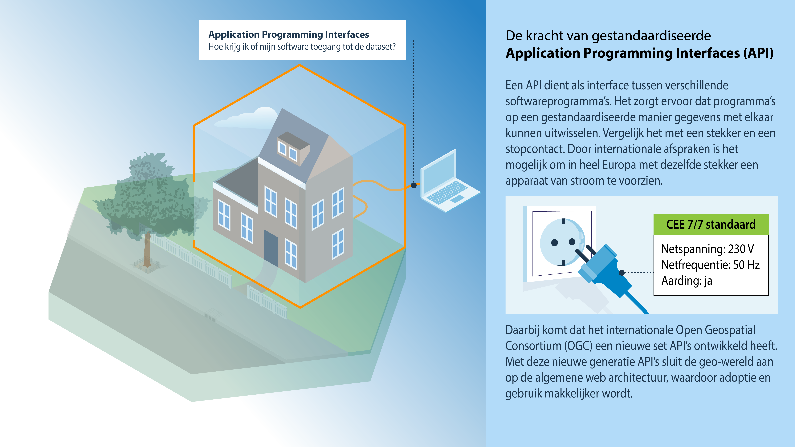

# Application Programming Interfaces

**Een API dient als interface tussen verschillende softwareprogramma's.**
**Het zorgt ervoor dat programma's op een gestandaardiseerde manier gegevens met elkaar kunnen uitwisselen.**
**Vergelijk het met een stekker en een stopcontact. Door internationale afspraken is het mogelijk om in heel Europa met dezelfde stekker een apparaat van stroom te voorzien.**

Voor het kunnen vinden, raadplegen, en downloaden van geo-informatie op het
Internet zijn Application Programming Interfaces (API’s) in gebruik. API’s
spelen een belangrijke rol op het Internet.
Een API dient als interface tussen verschillende softwareprogramma's. Het zorgt
ervoor dat een applicatie automatisch toegang krijgt tot de data.

<figure id="pd3">

<figcaption>Application Programming Interfaces</figcaption>
</figure>

> Denk bij het maken, gebruiken of doorontwikkelen van API's aan de volgende onderwerpen:
  - Uitfaseren van WMS/WFS en inzetten op de nieuwe generatie OGC API's.
  - De huidige versie van de OGC API's is nog gebaseerd op OAS 3.0.x, ondersteuning voor OAS 3.1 (json schema compatibiliteit) zit eraan te komen.
  - De OGC API Standaarden worden nog verder uitgebreid, dit gebeurt via zogenaamde 'parts', 
  check welke parts er aan komen met aanvullende functionaliteit die relevant kan zijn voor het beoogde gebruik. Deze informatie is terug te vinden op de 'Roadmap' van het OGC.
  - De OGC API's sluiten aan bij de API Designrules van Kennisplatform API's.
  

## Transitie naar nieuwe generatie API's

De internationale geostandaarden voor API's komen veelal bij het [Open Geospatial Consortium (OGC)](https://www.ogc.org/) vandaan. De eerste generatie API standaarden, toen nog 'services' genaamd, zijn gebaseerd op XML en SOAP. Deze standaarden zijn nog steeds geldig en in gebruik, maar worden gaandeweg vervangen door een nieuwe generatie, die is gebaseerd op algemene Web architectuur, zoals REST. Het voordeel van deze nieuwe API's is dat geo-informatie onderdeel wordt van het ecosysteem van het Web en zo voor een veel breder publiek toegankelijk is.

Het OGC is de oude generatie 'services' standaarden langzaam aan het uit faseren. De nieuwe OGC API standaarden zijn deels in ontwikkeling, deels al goedgekeurd. Het is aan te raden om in nieuwe voorzieningen zoveel mogelijk de nieuwe OGC API standaarden toe te passen. De eerste nieuwe OGC API standaarden zijn inmiddels ook op de Pas toe of Leg Uit Lijst van het Forum Standaardisatie geplaatst. Op de Pas toe of Leg Uit (PTLU) lijst staan nu de nieuwe generatie standaarden: OGC API Features en OGC API Tiles. De WMS en WFS-profielen zijn verhuisd naar de lijst van aanbevolen standaarden van het Forum Standaardisatie. Bestaande voorzieningen, die op de oude 'services' standaarden zijn gebaseerd kunnen nog langere tijd in de lucht gehouden worden. Maar we adviseren om de nieuwe OGC API’s te gaan gebruiken. Het is ook mogelijk om OGC API's beschikbaar te stellen als laag bovenop oude generatie 'services'. Hiervoor is software beschikbaar.

## Overzicht geostandaarden API’s

In het overzicht van geostandaarden voor API’s zijn de standaarden per thema in tabellen opgenomen:

-   API standaarden voor het opvragen van webmaps: OGC WMS en OGC API Maps (tabel 5.1);
-   API standaarden voor het bevragen (downloaden) van vectordata: OGC WFS, OGC
    API Features en ATOM (tabel 5.2);
-   API standaarden en specificaties voor het opvragen (downloaden) van
    rasterdata: OGC WCS en OGC API Coverages (tabel 5.3);
-   API Standaarden en specificaties voor het opvragen (downloaden) van
    sensordata: OGC SOS, OGC SensorThings API en OGC API Environmental Data Retrieval (tabel 5.4);
-   API Standaarden en specificaties voor bevragen van metadata catalogi: OGC
    CSW en OGC API Records (tabel 5.5);
-   API standaarden en specificaties voor opvragen van kaarttegels: OGC WMTS,
    OGC API Tiles, 3D Tiles (tabel 5.6);
-   API standaarden en specificaties voor linked data: GeoSPARQL (Tabel 5.7).

In onderstaand overzicht zijn de nieuwe generatie OGC API standaarden opgenomen die zijn goedgekeurd, maar ook de OGC API standaarden die nog in ontwikkeling of draft zijn. Dit is bij elke standaard aangegeven.

### APIs en Linked Data
APIs en Linked Data zijn twee verschillende manieren om gegevens beschikbaar te stellen via interfaces, maar tussen beide bestaat een bepaalde samenhang. In sommige situaties kun je als data aanbieder beter kiezen voor één van de twee, in sommige situaties kun je beide combineren.

De belangrijkste punten ter overweging zijn: 
- Linked Data omvat zowel een datamodel standaard (RDF) als een interface standaard (SPARQL). 
- APIs en Linked Data bedienen verschillend publiek. Het publiek voor APIs is groter: de meeste ontwikkelaars prefereren het. 
- APIs kun je zien als veelgestelde vragen voorziening, terwijl een gebruiker met een Linked Data SPARQL endpoint zijn eigen vragen kan formuleren. 
- In APIs wordt meestal de data als JSON verstuurd. Het is echter ook mogelijk om in een API Linked Data (RDF) te serveren. Aanbeveling: Geef altijd in eerste instantie JSON terug, zoals voorgeschreven door de API Design Rules Geo-module [[adr-mod-geo]]. Geef alleen Linked Data als de gebruiker daarom vraagt. 
- APIs worden vooral gebruikt om toegang tot data te regelen, terwijl Linked Data meestal een rol speelt op het niveau van metadata. Denk aan het Nederlands profiel op DCAT, [[dcat-ap-nl]], het Metamodel voor Informatie Modellering [[MIM]] en de standaard voor het beschrijven van begrippen [[SBB]]. 

<aside class="example">Een praktisch voorbeeld waar het wenselijk is om Linked Data in een API te serveren, is het toegankelijk maken van metadata in een catalogus. De aanbeveling in die situatie is om OGC API Records te gebruiken om DCAT-AP-NL (een op Linked Data RDF gebaseerde standaard) uit te wisselen. Echter, zelfs in die situatie moet nog steeds de API de metadata in JSON geven, tenzij de gebruiker om een linked data formaat (bijvoorbeeld turtle of rdf/xml) vraagt. 
</aside>

APIs en Linked Data kunnen samen een krachtig geheel vormen. Door de API beschrijving en in de API geserveerde data te linken aan de metadata (in DCAT-AP-NL), het informatiemodel (in MIM) en de begrippen en definities (in NL-SBB) heeft een gebruiker zowel de data zelf als alle informatie erover, binnen handbereik.

## Web mapping API's

*Tabel 5.1 - API standaarden en specificaties voor web mapping: OGC WMS en OGC API Maps*

<table>
  <colgroup>
  <col style= "width: 34%;" >
  <col style= "width: 33%;" >
  <col style= "width: 33%;" >
   </colgroup>
  <thead>
    <tr>
      <th> Internationale standaarden en specificaties </th>
      <th> Europese profielen </th>
      <th> Nederlandse profielen </th>
    </tr>
  </thead>
  <tbody>
    <tr>
      <td>OGC API Maps version 1.0 [[OAPIMAPS]] </td>
      <td> </td>
      <td> </td> 
     </tr>
    <tr>
      <td>Web Map Server (WMS) Implementation Specification, version 1.3.0 [[WMS]] </td>
      <td>Technical Guidance for the implementation of Inspire View Service. [[INSTGVS]] </td>
      <td>Nederlands profiel op ISO 19128 Geographic information — Web Map Server Interface versie 1.0 [[NLWMS]] </td>
     </tr>
    <tr>
      <td>ISO 19128 Geographic Information – Web Map Service (WMS) [[iso-19128-2005]] </td>
      <td> </td>
      <td> </td>
     </tr>
  </tbody>
</table>

## Vectordata API's

*Tabel 5.2 – API standaarden en specificaties voor vectordata: OGC WFS, OGC API – Features en ATOM*

<table>
  <colgroup>
  <col style= "width: 34%;" >
  <col style= "width: 33%;" >
  <col style= "width: 33%;" >
   </colgroup>
  <thead>
    <tr>
      <th> Internationale standaarden en specificaties </th>
      <th> Europese profielen </th>
      <th> Nederlandse profielen </th>
    </tr>
  </thead>
  <tbody>
    <tr>
      <td>OGC API – Features Part 1 Core [[OAPIF1]] </td>
      <td>OGC API – Features as an INSPIRE download service [[INSGPOAPIF]] </td>
      <td>API Design Rules Geomodule [[adr-mod-geo]] </td>
     </tr>
    <tr>
      <td>OGC API – Features Part 2 CRS by reference v1.0.1 [[OAPIF2]] </td>
      <td> </td>
      <td>API Design Rules Geomodule [[adr-mod-geo]] </td>
     </tr>
    <tr>
      <td>OGC API – Features Part 3 Filtering version 1.0 [[OAPIF3]] </td>
      <td> </td>
      <td> </td>
     </tr>
    <tr>
      <td>OGC API – Features Part 4 Create Replace Update and Delete **Draft** [[OAPIF4]] </td>
      <td> </td>
      <td> </td>
    </tr>
    <tr>
      <td>OGC API – Features Part 5 Schemas **Draft** [[OAPIF5]] </td>
      <td> </td>
      <td> </td>
    </tr>
    <tr>
      <td>Web Feature Service (WFS) Implementation Specification, version 1.1.3 [[WFS11]] </td>
      <td>Technical Guidance for the implementation of Inspire Download Services. [[INSTGDS]] </td>
      <td>Nederlands WFS Profiel 1.0 op OGC WFS 1.1.0 [[NLWFS]] </td>
     </tr>
    <tr>
      <td>ISO 19142, Geographic information - Web Feature Service (= WFS version 2.0) [[iso-19142-2010]], [[WFS]] </td>
      <td> </td>
      <td> </td>
     </tr>
    <tr>
      <td>OGC Filter Encoding 2.0 Encoding Standard - With Corrigendum [[FE20]] </td>
      <td> </td>
      <td> </td>
     </tr>
    <tr>
      <td>ISO 19143, Geographic information – Filter encoding [[iso-19143-2010]] </td>
      <td> </td>
      <td> </td>
     </tr>
    <tr>
      <td>ATOM [[rfc4287]] </td>
      <td> </td>
      <td> </td>
     </tr>
  </tbody>
</table>

**Handreikingen**

Handreikingen voor implementatie:
  - [OGC API Features Guideline](https://docs.geostandaarden.nl/api/ogc-api-features-guideline/)

## Rasterdata API's

*Tabel 5.3 – API standaarden en specificaties voor rasterdata: OGC WCS en OGC API - Coverages*

<table>
  <colgroup>
  <col style= "width: 34%;" >
  <col style= "width: 33%;" >
  <col style= "width: 33%;" >
   </colgroup>
  <thead>
    <tr>
      <th> Internationale standaarden en specificaties </th>
      <th> Europese profielen </th>
      <th> Nederlandse profielen </th>
    </tr>
  </thead>
  <tbody>
  <tr>
      <td>OGC API - Coverages - Part 1: Core, version 0.0.7 **Draft** [[OAPIC]] </td>
      <td> </td>
      <td> </td>
     </tr>
    <tr>
      <td>OGC Web Coverage Service (WCS), version 2.1 [[WCS21]] </td>
      <td>Technical Guidance for the implementation of Inspire Download Services using Web Coverage Services (WCS). [[INSTGDSWCS]] </td>
      <td>Hetzelfde als het Europese profiel </td>
     </tr>
  </tbody>
</table>

## Sensordata API's 

*Tabel 5.4 – API Standaarden en specificaties voor sensordata: OGC SOS, EDR API en SensorThings API*

<table>
  <colgroup>
  <col style= "width: 34%;" >
  <col style= "width: 33%;" >
  <col style= "width: 33%;" >
   </colgroup>
  <thead>
    <tr>
      <th> Internationale standaarden en specificaties </th>
      <th> Europese profielen </th>
      <th> Nederlandse profielen </th>
    </tr>
  </thead>
  <tbody>
    <tr>
      <td>OGC SensorThings API part 1 Sensing, version 1.1 [[STAS]] </td>
      <td> OGC SensorThings API as an INSPIRE download service (good practice) [[INSGPSTA]] </td>
      <td> </td>
     </tr>
    <tr>
      <td>OGC SensorThings API Part 2 Tasking Core, version 1.0 [[STAT]] </td>
      <td> </td>
      <td> </td>
     </tr>
    <tr>
      <td>OGC API - Environmental Data Retrieval Standard, version 1.1 [[OAPIEDR]] </td>
      <td> </td>
      <td> </td>
     </tr>
    <tr>
      <td>OGC Sensor Observation Service Interface Standard version 2.0 [[SOS]] </td>
      <td>Technical Guidance for implementing download services using the OGC Sensor Observation Service and ISO 19143 Filter Encoding [[INSTGDSSOS]] </td>
      <td> Hetzelfde als het Europese profiel </td>
     </tr>
  </tbody>
</table>

## Metadata API's 

*Tabel 5.5 – API Standaarden en specificaties voor metadata: OGC CSW en OGC API - Records*
<table>
  <colgroup>
  <col style= "width: 34%;" >
  <col style= "width: 33%;" >
  <col style= "width: 33%;" >
   </colgroup>
  <thead>
    <tr>
      <th> Internationale standaarden en specificaties </th>
      <th> Europese profielen </th>
      <th> Nederlandse profielen </th>
    </tr>
  </thead>
  <tbody>
    <tr>
      <td>OGC API - Records - Part 1: Core **Draft** [[OAPIRECORDS1]] </td>
      <td> </td>
      <td> </td>
     </tr>
    <tr>
      <td>OGC Catalogue Service for the Web (CSW) Implementation Specification, version 2.0.2 [[CSW]] </td>
      <td>Technical Guidance for the implementation of Inspire Discovery Services. [[INSTGDiS]] </td>
      <td>Hetzelfde als het Europese profiel </td>
     </tr>
    <tr>
      <td>CSW2 AP ISO, Catalogue Services Specification 2.0.2 - ISO Metadata Application Profile, Version 1.0.0, [[CSWISOAP]] </td>
      <td> </td>
      <td> </td>
     </tr>
  </tbody>
</table>

## Map tile APIs

*Tabel 5.6 – API standaarden en specificaties voor map tiles: OGC Web Map Tile Service (WMTS,) OGC API - Tiles, en 3D Tiles*

<table>
  <colgroup>
  <col style= "width: 34%;" >
  <col style= "width: 33%;" >
  <col style= "width: 33%;" >
   </colgroup>
  <thead>
    <tr>
      <th> Internationale standaarden en specificaties </th>
      <th> Europese profielen </th>
      <th> Nederlandse profielen </th>
    </tr>
  </thead>
  <tbody>
    <tr>
      <td>OGC API - Tiles - Part 1: Core [[OAPITILES1]] </td>
      <td> </td>
      <td> </td>
     </tr>
    <tr>
      <td>OGC 3D Tiles 1.1 [[3DTILES]] </td>
      <td> </td>
      <td> </td>
     </tr>
    <tr>
      <td>Web Map Tile Service Implementation Standard (WMTS) v1.0.0 [[WMTS]] </td>
      <td>Technical Guidance for the implementation of Inspire View Service [[INSTGVS]] </td>
      <td>Hetzelfde als het Europese profiel </td>
     </tr>
  </tbody>
</table>

**Handreikingen**

Handreikingen voor implementatie:
-   [Praktijkrichtlijn Vector Tiling (2021)](https://docs.geostandaarden.nl/serv/vt/)
-   [Handreiking Best practices Vector Tiling (2021)](https://geonovum.github.io/vector-tiling-best-practices/)

## Linked Data API's

*Tabel 5.7 – API standaarden en specificaties voor linked data: GeoSPARQL*

<table>
  <colgroup>
  <col style= "width: 34%;" >
  <col style= "width: 33%;" >
  <col style= "width: 33%;" >
   </colgroup>
  <thead>
    <tr>
      <th> Internationale standaarden en specificaties </th>
      <th> Europese profielen </th>
      <th> Nederlandse profielen </th>
    </tr>
  </thead>
  <tbody>
    <tr>
      <td>GeoSPARQL - A Geographic Query Language for RDF Data v1.0 [[GeoSPARQL]] </td>
      <td> </td>
      <td> </td>
     </tr>
    <tr>
      <td>GeoSPARQL - A Geographic Query Language for RDF Data v1.1 [[GEOSPARQL11]] </td>
      <td> </td>
      <td> </td>
     </tr>
  </tbody>
</table>

**Handreikingen**

Handreikingen voor implementatie: 
- NEN 3610 - Linked Data [[NLDP]]

<aside class="note">GeoSPARQL heeft een interactiedeel en een beknopt informatiemodel (ontologie) voor geodata. Deze handreiking gaat vooral over het informatiemodel. Daarmee heeft deze verwijzing of noot ook een relatie met het hoofdstuk over informatiemodellen. </aside>
 
## Kwaliteit van API’s

**API Strategie overheid (beleid) en REST Design Rules**

In de Nederlandse API strategie en Rest Design Rules worden diverse aanbevelingen gedaan voor de kwaliteit van API's. 

De Nederlandse API Strategie [[NLAPIS]] bestaat uit een informatief deel over beleid, gebruikerswensen, architectuur en een normatief deel met ontwerprichtlijnen voor API's. Deze ontwerprichtlijnen zijn aangemeld voor plaatsing op de ‘Pas toe of leg uit’-lijst van het Forum Standaardisatie. Zowel de API Strategie als de ontwerprichtlijnen voor API's worden actief doorontwikkeld. 

De [Rest Design Rules](https://forumstandaardisatie.nl/open-standaarden/rest-api-design-rules) is een lijst afspraken, die ontwikkelaars volgen tijdens het bouwen van een REST-API voor de publieke sector. Door de regels te hanteren wordt de API voorspelbaar. En dat is prettig voor andere ontwikkelaars die er gebruik van willen maken. Dankzij deze regels blijft het makkelijk voor organisaties om gegevens met elkaar uit te wisselen. 

**Afspraken over quality of service**

Het is van belang om als service provider afspraken te maken met de service afnemers over de dienstverlening. Om de kwaliteit van een service uit te drukken zijn door INSPIRE bijvoorbeeld de drie typen kwaliteitsnormen voor services gedefinieerd (tabel 5.8).

*Tabel 5.8 – Voorbeeld van kwaliteitnormen voor services*

<table>
  <colgroup>
  <col style="width: 34%;">
  <col style="width: 33%;">
  <col style="width: 33%;">
   </colgroup>
  <thead>
    <tr>
      <th>Kwaliteitsnorm </th>
      <th>Uitleg </th>
      <th>Voorbeeld </th>
    </tr>
  </thead>
  <tbody>
    <tr>
      <td>Reliability </td>
      <td>Reliability verwijst naar de hoeveelheid gefaalde requests die een systeem mag teruggeven in een afgesproken tijd. </td>
      <td>Bijvoorbeeld 10 \* een gefaalde request voor een geo-service per week. </td>
     </tr>
    <tr>
      <td>Beschikbaarheid </td>
      <td>Beschikbaarheid meet het percentage van beschikbaarheid (uptime). Het uptime percentage = uptime / (uptime + downtime). </td>
      <td>Bijvoorbeeld de geo-service dient in 98% van de requests beschikbaar te zijn. </td>
     </tr>
    <tr>
      <td>Performance / response tijd </td>
      <td>De performance uitgedrukt in response tijd. </td>
      <td>Bijvoorbeeld een 800\*600 pixels image met 8bit kleuren dient een response tijd te hebben van maximaal 5 seconden. </td>
     </tr>
  </tbody>
</table>

**Validators**

Voor het valideren van services (WMS en WFS) zijn [validators](https://validatie.geostandaarden.nl/) beschikbaar. Met de ETF validator kan de kwaliteit van de WMS en WFS voor het grootste deel getoetst worden.

Voor het valideren van REST APIs op basis van de API Design Rules is een [validator](https://gitlab.com/commonground/don/adr-validator) ontwikkeld die inzicht geeft in de kwaliteit van API's.

Voor het valideren van OGC API's (Features, Processes en Records) is een linter ontwikkeld: [OGC-Checker](https://geonovum.github.io/ogc-checker). In de documentatie in de [Git Repository](https://github.com/Geonovum/ogc-checker) is in detail te vinden welke requirements uit de veschillende specificaties exact ondersteund worden.
