# Geo-standaarden in samenhang

**Het doel van het Raamwerk van geo-standaarden is om uit de grote verscheidenheid aan standaarden die er zijn voor geo-informatie, de juiste set 
te kiezen. In combinatie kunnen de geo-standaarden worden gebruikt om 'onder Architectuur' een geo-informatie infrastructuur te realiseren. In een dergelijke infrastructuur speelt elke standaard een eigen rol, maar uiteraard wel in samenhang met de andere standaarden.**

In dit hoofdstuk is gekeken naar de principes zoals die gelden in onze (Nederlandse) situatie. Er is gekeken naar internationale standaarden, en de architectuurprincipes die van  [NORA](#nora-nederlandse-overheids-referentie-architectuur), [FAIR](#fair-principes), [DAMA](#dama-dmbok-principes) en [NGII](#ngii-principes).

Belangrijk is de constatering dat er een zekere overlap zit in de verschillende sets aan principes.
Zo komen **Vindbaarheid** en **Toegankelijkheid** van data en informatie producten voor in NORA, FAIR en DAMA. FAIR legt daarnaast de nadruk op Interoperabel en Herbruikbaarheid van data, terwijl DAMA juist weer veel zegt over het borgen van de datakwaliteit.
Bij elkaar opgeteld vormen de verschillende Architectuurprincipes een mooi dekkende set aan principes.

## Internationale standaarden
Voor onze nationale geo-standaarden geldt dat deze ontwikkeld zijn op basis van Europese en internationale standaarden met de voor Nederland geldende specifieke eisen.

Op het moment dat een nationale standaard is ontwikkeld geldt dat een nationale standaard leidend is. Is er geen nationale standaard, dan geldt de Europese standaard en bij gebrek daaraan omdat de internationale of mondiale standaard de Europese of nationale behoefte afdekt, geldt een internationale, wereldwijde standaard.

Internationaal zijn voor Nederland de [ISO/TC 211  Geographic information/Geomatics](https://www.iso.org/committee/54904.html), het [Open Geospatial Consortium](https://www.ogc.org/) (OGC) en het [World Wide Web Consortium](https://www.w3.org/) (W3C) van groot belang. ISO/TC211 en het OGC maken als standaardisatie organisaties technische geo-standaarden, die Nederland semantisch en technisch invult. Deze geo-standaarden organisaties hebben uiteraard weer liaisons met de algemene ICT en Internet standaardisatie organisaties zoals het W3C. Geonovum participeert namens Nederland actief in deze internationale standaardisatie organisaties.

De Europese profielen zijn opgesteld op basis van internationale standaarden en zijn verankerd in de Europese [INSPIRE](https://inspire.ec.europa.eu/) kaderrichtlijn. De Europese profielen zijn een nadere invulling van de internationale standaarden en de INSPIRE data specificaties voor de thema’s hebben een duidelijke relatie met de informatiemodellen in Nederland. Dit zijn de INSPIRE technical guidelines, ISO of OGC standaarden die door INSPIRE zijn voorgeschreven, en Nederlandse profielen die compliant zijn met INSPIRE. Hoewel INSPIRE formeel geen standaardisatie organisatie is, worden de invoeringsregels van INSPIRE wel als zodanig gebruikt in Nederland.

Tot slot, zijn Nederlandse profielen te onderscheiden, die ook gebaseerd zijn of opgelijnd zijn met de internationale en Europese profielen. Een deel van de Nederlandse geo-standaarden profielen heeft een aparte positie op de ['pas toe of leg uit'](https://www.forumstandaardisatie.nl/open-standaarden) lijst van verplichte open standaarden van het Forum Standaardisatie van de Nederlandse digitale overheid. Deze geo-standaarden zijn van primair belang in het aansluiten van geo-informatie op de digitale overheid (voorheen e-overheid).

## NORA - Nederlandse Overheids Referentie Architectuur
De geo-standaarden moeten passen binnen de architectuur van organisaties. Aangezien dat meestal overheden zijn, kunnen en willen wij niet om de [Nederlandse Overheids Referentie Architectuur](https://www.noraonline.nl/) (NORA) heen. 

NORA onderkent 5 lagen, zoals weergegeven in onderstaande figuur:
- De [Grondslagenlaag](https://www.noraonline.nl/wiki/Grondslagenlaag)
- De [Organisatorische laag](https://www.noraonline.nl/wiki/Organisatorische_laag)
- De [Informatielaag](https://www.noraonline.nl/wiki/Informatielaag)
- De [Applicatielaag](https://www.noraonline.nl/wiki/Applicatielaag)
- De [Netwerklaag](https://www.noraonline.nl/wiki/Netwerklaag)

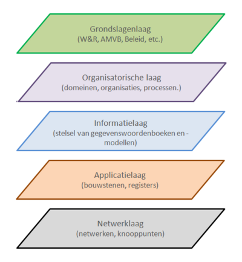

NORA is in 2022 flink aangepast. De Basisprincipes zijn omgezet naar [Kwaliteitsdoelen](https://www.noraonline.nl/wiki/Kwaliteitsdoelen) en de Afgeleide Principes zijn omgezet naar [Architectuurprincipes](https://www.noraonline.nl/wiki/Architectuurprincipes). Een overzicht van de Kernwaarden, Kwaliteitsdoelen en Beleidskaders vind je [hier](https://www.noraonline.nl/wiki/Grafisch_overzicht_relaties_Kernwaarden_en_Kwaliteitsdoelen_met_Beleidskaders). 

Principes als [Vindbaarheid](https://www.noraonline.nl/wiki/Vindbaar_(Doel)), [Toegankelijkheid](https://www.noraonline.nl/wiki/Toegankelijk_(Doel)) en [Transparantie](https://www.noraonline.nl/wiki/Transparant_(Doel)) zijn belangrijke principes. NORA stelt de “[pas-toe-of-leg-uit](https://www.forumstandaardisatie.nl/open-standaarden)” lijst van het Forum Standaardisatie verplicht. Overheden zijn daarmee verplicht om bij aanschaf van IT systemen eerst op die lijst te kijken. De geo-standaarden staan deels ook op de lijst (de basisset generiek [geo-standaarden](https://www.forumstandaardisatie.nl/open-standaarden/geo-standaarden)), en daarmeewordt via de grondslagenlaag van NORA invulling gegeven aan het 'verankeren' van de geo-standaarden en geo-informatie infratsructuur in de nationale digitale overheid.

## Architectuur principes

### FAIR Principes

Op eenduidige manieren samenwerken om informatie zo beter te kunnen beveiligen,makkelijker uit te wisselen en toegankelijker te maken voor iedereen. Dat is hoe open standaarden de samenwerking bevorderen tussen de overheid, burger en het bedrijfsleven. De [FAIR Principes](https://www.go-fair.org/fair-principles/) zijn een hulpmiddel daarin: het doel van de principes is het hergebruik van waardevolle data mogelijk maken. De FAIR Principes dwingen geen standaarden af, maar moedigen communities aan om data en diensten vindbaar, toegankelijk, interoperabel en herbruikbaar te maken.  

De geo-standaarden maken geo-informatie FAIR: De verbindende kracht van standaardisatie in vindbare, toegankelijke, uitwisselbare en herbruikbare geo-informatie: 
- **Findable** (vindbaar). De eerste stap bij het (her)gebruiken van data is om de data te vinden. Metadata en data moeten gemakkelijk te vinden zijn voor zowel mensen als computers. Machine-readable metadata zijn essentieel voor het ontdekken van data.
- **Accessible** (toegankelijkheid). Zodra de gebruiker de benodigde data heeft gevonden, moet de gebruiker weten hoe deze kunnen worden geraadpleegd, inclusief het verkrijgen van toegang (authenticatie en autorisatie).
- **Interoperable** (interoperabel). De data moeten meestal worden geïntegreerd met andere data. Bovendien moeten de data samenwerken met applicaties of workflows voor analyse, opslag en verwerking.
- **Reusable** (herbruikbaar), Het uiteindelijke doel van FAIR is het hergebruik van data te optimaliseren. Om dit te bereiken moeten metadata en data goed worden beschreven, zodat ze in verschillende situaties kunnen worden gerepliceerd en/of gecombineerd.

### DAMA DMBOK Principes

Er is veel (geo)data beschikbaar binnen de overheid. Zaak dus dat deze data goed wordt gemanaged. Rondom datamanagement is [DAMA](https://www.dama.org/cpages/mission-vision-purpose-and-goals) opgericht. DAMA International is een non-profit, leverancieronafhankelijke, wereldwijde vereniging van technische en zakelijke professionals die zich toelegt op het bevorderen van de concepten en praktijken van informatie- en gegevensbeheer.

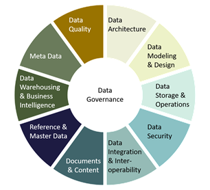

De DAMA Cirkel onderkent een aantal gebieden, die van belang zijn om data goed te kunnen managen. Zaken als data-kwaliteit, data integratie en interoperabiliteit staan uiteraard in deze cirkel.

DAMA is niet zozeer een standaard die de data zelf beschrijft, maar het beschrijft wel hoe data als een asset moet worden gezien, en hoe de governance is geregeld. DAMA kent kwaliteits principes zoals "1-Bron-1-Waarheid", waarmee wordt bedoeld dat er bij het hebben van meerdere bronnen met dezelfde data over hetzelfde object nooit met zekerheid gezegd kan worden welke bron de waarheid bevat. Iets dat steeds belangrijker wordt als we meer van federatieve systemen gebruik gaan maken. Dan moet heel duidelijk afgesproken worden **wie** de **data eigenaar** is, en **wat** er met de data mag worden gedaan. En daarom is DAMA in dit raamwerk opgenomen.  

### BOMOS Principes

Geonovum heeft het beheer van de alle geo-standaarden ingericht langs de lijnen van het [Beheer- en Ontwikkelmodel voor Open Standaarden (BOMOS)](https://www.logius.nl/diensten/bomos). Voor ontwikkeling en beheer van de basisset geo-standaarden voeren wij sinds december 2014 het predicaat: Uitstekend beheerproces. Dit predicaat is uitgereikt door het Forum Standaardisatie.

Geonovum gebruikt BOMOS voor alle standaarden die het in beheer heeft, om te garanderen dat deze open zijn volgens de definitie die BOMOS hieraan geeft. De toepassing van BOMOS zorgt er bovendien voor dat de standaarden zonder wettelijke grondslag, die Geonovum beheert en ontwikkelt in aanmerking komen voor: 
- Plaatsing op de lijst verplichte standaarden of aanbevolen standaarden van het Forum Standaardisatie. Dit is de lijst met open standaarden die Nederlandse overheden en organisaties uit de publieke sector verplicht of vrijwillig zijn te gebruiken bij hun gegevensuitwisseling en de beveiliging daarvan.
- Predicaat ‘Uitstekend Beheer’ van het Forum Standaardisatie, en dat predicaat geeft recht op het gebruik van de verkorte procedure bij updates van versies van standaarden op de lijsten.
Geonovum is aangesloten bij de BOMOS community en neemt deel aan de BOMOS klankbordgroep. BOMOS is in beheer bij het Centrum voor Standaarden bij [Logius](https://www.logius.nl/diensten/bomos). 

Kernwaarden van BOMOS die Geonovum uitdraagt:
1. Een standaard die niet beheerd wordt is geen standaard.
2. Een standaard beheren is geen (tijdelijk) project, maar een proces.
3. Een standaard ontwikkelen en beheren is een situationeel proces, en kan daardoor voor elke standaard anders ingevuld zijn.
4. Een standaard is nooit af, ook als deze richting het einde van zijn levenscyclus gaat. 
5. De openheid van de standaard wordt volledig bepaald door de inrichting van het ontwikkel- en beheerproces.

Hoe wij binnen Geonovum BOMOS gebruiken staat beschreven in onze [beheerdocumentatie voor de geo-standaarden](https://docs.geostandaarden.nl/gbd/gsb/)

### MIM Principes

Om alle informatiemodellen in Nederland nog beter op elkaar aan te laten sluiten is een metamodel ontwikkeld voor informatiemodellering. [MIM](https://docs.geostandaarden.nl/mim/mim/) (Metamodel voor Informatiemodellering) dient als gemeenschappelijk vertrekpunt voor het opstellen van informatiemodellen, zodat informatiemodellen en de daarop gebaseerde standaarden voor gegevensuitwisseling meer compatibel worden. MIM voorziet enerzijds in duidelijke afspraken over het vastleggen van gegevensspecificaties en biedt anderzijds ruimte aan de verschillende niveaus van modellering. De expertgroep Gegevensmanagement van [NORA](https://www.noraonline.nl/wiki/MIM_(Metamodel_voor_informatiemodellen)) heeft voor het thema Gegevensmanagement het MIM gebruikt als voorzet voor een gemeenschappelijke taal waarin we gegevenswoordenboeken, informatiemodellen etc. kunnen beschrijven. 

MIM onderkent 4 niveaus van informatiemodellering.

**Niveau 1 Begrippenmodel**
Het begrippenmodel bevat de definities van alle gegevens die je voor het uitvoeren van een bepaalde taak gebruikt. Gegevens kunnen afhankelijk van de context waarin ze worden gebruikt, verschillende dingen betekenen. Het begrippenmodel is er om spraakverwarring te voorkomen.

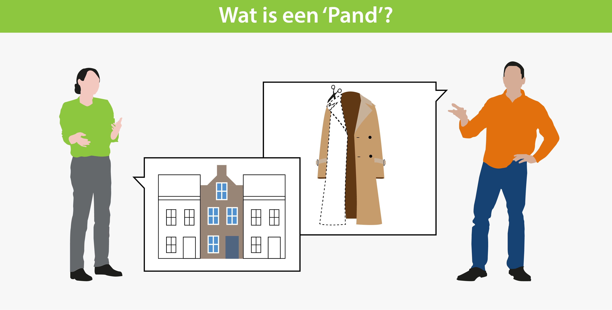 

**Niveau 2 Conceptueel model**
In het conceptuele model leggen we alle dingen (concepten) vast die nodig zijn voor de uitvoering van een bepaalde taak. We geven daarbij aan hoe deze dingen zich tot elkaar verhouden en welke eigenschappen van die dingen relevant zijn. Het conceptueel model kan je zien als het vertaalwoordenboek van domeinexperts naar informatie-analisten. Het zorgt ervoor dat ‘de usiness’ en de ICT-specialisten elkaar begrijpen.

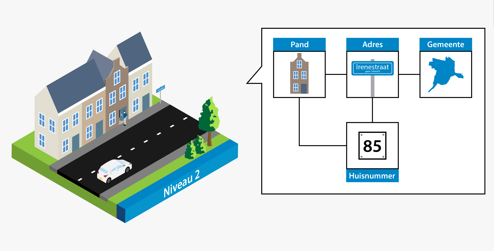 

**Niveau 3 Gegevensmodel, ook wel logisch model**
In het gegevensmodel maken we een blauwdruk op basis waarvan je een database kunt inrichten. Begrippen, kenmerken en de onderlinge relaties zijn hierin schematisch weergegeven. Het gegevensmodel zorgt ervoor dat iedereen altijd dezelfde kenmerken vastlegt, dezelfde relaties tussen gegevens kan leggen en deze gegevens ook met behoud van context kan uitwisselen. Ongeacht de database of software die iemand gebruikt.
Het gegevensmodel beschrijft wat er moet worden vastgelegd, zonder voor te schrijven hoe je dit in de praktijk implementeert. Een gegevensmodel is een hulpmiddel voor ontwerpers, bouwers en beheerders van ICT-voorzieningen.

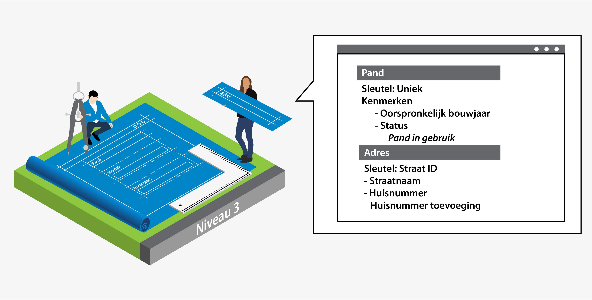 

**Niveau 4 Datamodel, ook wel technisch model**
Een datamodel kan je beschouwen als de grammatica voor je data. Het beschrijft de structuur en eigenschappen van de technische taal waarin je informatie kan vastleggen en uitwisselen. Het datamodel kan ook afspraken bevatten over de manier waarop je berichten ‘verpakt’, het (internet)protocol en de logistiek van het berichtenverkeer.
Het datamodel zorgt ervoor dat de gegevens digitaal verwerkt kunnen worden. Het zijn hulpmiddelen voor software-ontwikkelaars.

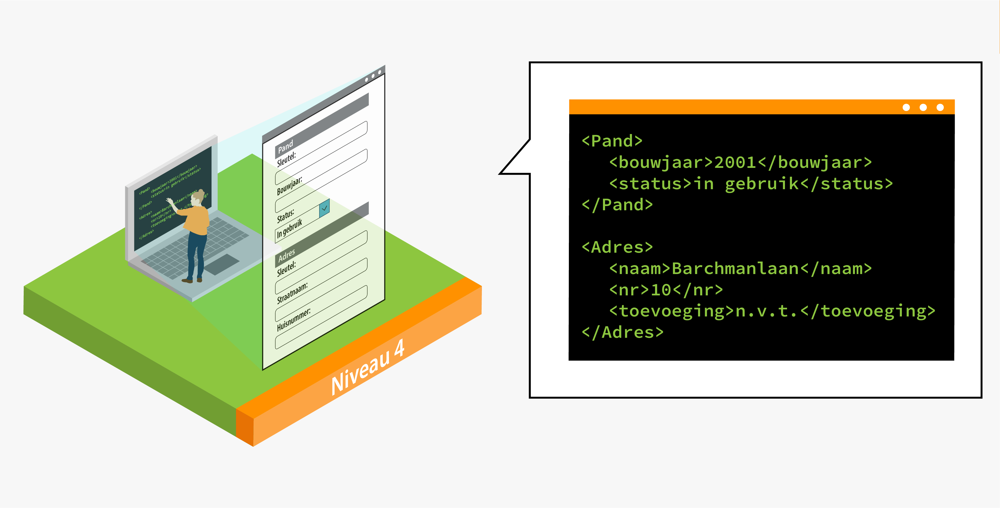 
 
### NGII Principes

Om geo-informatie zo laagdrempelig mogelijk te ontsluiten is in Nederland de afgelopen jaren gewerkt aan een Nationale Geo-Informatie Infrastructuur (NGII). De NGII als concept is het geheel van geo-informatie(bronnen), metadata, standaarden, voorzieningen, netwerkdiensten, organisatie en afspraken voor de efficiënte uitwisseling van en toegang tot geo-informatie. 

Belangrijke eigenschappen (inrichtingsprincipes) van de NGII zijn: 
- **1 Bron, 1 Waarheid**. Hiermee wordt bedoeld dat data slechts 1 maal wordt opgeslagen, en op meervoudig gebruikt wordt.
- **Scheiding applicaties, voorzieningen en data** Data hoort niet opgesloten te zitten in applicaties. Data is veel belangrijker dan applicaties, en bestaat ook langer dan de meeste applicaties. Een applicatie gaat gemiddeld 10 tot 15 mee, terwijl sommige data meer dan 100 jaar oud is. 
- **Uitwisseling en presentatie via open standaarden** Het uitwisselen van data moet zoveel mogelijk met open standaarden worden gedaan. Daarmee wordt de kans dat data ontoegankelijk wordt omdat een standaard niet meer beschikbaar is een heel stuk kleiner.

**Verkenning NGII**

In de afgelopen tien jaar is duidelijk geworden dat data meer zijn dan het bijproduct van specifieke werkprocessen die mogelijk geschikt zijn voor hergebruik. Data zijn een essentiële grondstof. Dit vraagt om een frisse blik op de mogelijkheden van onze data-infrastructuur.

Wanneer we data omzetten in informatie en informatie in kennis, dan worden data een essentiële grondstof voor het maken van keuzes. In Europa vinden we het daarbij belangrijk dat keuzeprocessen transparant zijn. Betrokken burgers moeten overheidsbeleid kunnen controleren en er zelf actief aan kunnen bijdragen met nieuwe initiatieven of alternatieven. Van een infrastructuur die laagdrempelig toegang biedt tot individuele databronnen, verschuift de vraag naar een infrastructuur die het kunnen combineren van data uit verschillende bronnen ondersteunt. Het belang van zowel semantische als technische interoperabiliteit
neemt steeds verder toe.

"De Nederlandse Geo-informatie Infrastructuur is toe aan een upgrade” schreven we in de Geonovum meerjarenvisie 2021-2023. Hoe kan de NGII een upgrade krijgen richting een vraaggedreven infrastructuur, die de kracht van locatiedata laagdrempelig inzetbaar maakt voor de grote maatschappelijke opgaven? Welke (nieuwe) standaarden spelen daarbij een rol? Hoe hangen allerlei afzonderlijke ontwikkelingen eigenlijk met elkaar samen? En hoe verhoudt de NGII 2.0 zich bijvoorbeeld tot een Nationale Digital Twin Infrastructuur? En hoe verhouden die ontwikkelingen zich toch Europese ontwikkelingen rond data en digitalisering? In een [Whitepaper Visie op upgrade Nederlandse Geo-informatie Infrastructuur(NGII)](https://docs.geostandaarden.nl/ngii/wpungii/) zijn de antwoorden gezocht op die vragen. En omdat die antwoorden meer waarde hebben, wanneer ze breed gedragen worden in het werkveld, is dit white paper ook in publieke consulatie gebracht en vervolgens aangescherpt. 

## Het 3-laags pacelayer model

Een model waarin de bovenstaande principes worden gebruikt is het 3-laags pacelayermodel van Gartner. Dit model ontkoppelt data en applicaties, data-silo's komen in het model niet voor, er wordt een duidelijk onderscheid gemaakt tussen data en informatie, en het bijhouden van data, het bewerken van data tot informatie en het gebruiken van de informatieprodcuten. De 3 lagen in dit model zijn Het System of Records (SoR), het System of Integration (SoI) en het System of Engagement (SoE). 

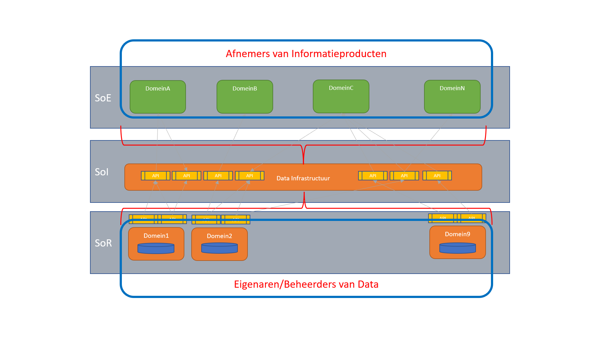

In het **System of Records** vind de registratie van data plaats. Bij registreren is het datakwaliteit heel belangrijk. Om die kwaliteit te borgen werken standaarden, informatiemodellen en applicaties nauw samen. De data-eigenaar (zie DAMA) heeft een belangrijke rol, immers de data-eigenaar bepaalt welke data wordt geregistreerd bij een object, en aan welke kwaliteitseisen (zie DAMA) de data moet voldoen.

In de laag **System of Integration** (SoI) wordt data gecombineerd en/of verwerkt tot informatieproducten. Op die manier ontstaat een intgraal beeld over de verschillenden objecten. Ook hier speelt de data-eigeaar een belangrijke rol. Immers de data eigenaar bepaalt wat er met de data kan en mag gebeuren. Daarbij zijn principes als datakwalitiet belangrijk, maar ook is (data)privacy en (data)security hier belangrijk.

In de laag **System of Engagement** (SoE) boven de SoI worden de informatieproducten uit de SoI gebruikt en gepresenteerd aan de afnemers van die informatieproducten. 

Om een echte ontkoppeling tussen data en applicaties te bewerkstelligen vind alle 'transport' van data en informatie plaats via **API's** - Application Programming Interface's. Er is een [API-Strategie voor de Nederlandse Overheid](https://docs.geostandaarden.nl/api/API-Strategie/).

## Het Raamwerk Geo-standaarden geplot op het pacelayermodel
In deze paragraaf worden de verschillende categorieën geo-standaarden 'geplot' op het pacelayermodel. Dat geeft meteen een indicatie van 'waar' in het landschap een bepaalde categorie geo-standaarden een rol speelt. In de paragrafen in dit hoofdstuk wordt een korte toelichting gegeven van de geo-standaarden en waarom ze in één of meer lagen van het pacelayermodel zijn opgenomen. 

### Gebruikers
De gebruikers zijn de belangrijkste onderdelen van de architectuurplaat. Immers daar doen we het allemaal voor. De architectuur en alle onderdelen zijn erop gericht om een goede informatieverstrekking te kunnen doen. Informatie waarop beslissingen worden gebaseerd. Gebruikers kunnen op allerlei verschillende manieren toegang krijgen tot de informatie. Denk hierbij aan viewers, dashboards, rapportages enz.. Het medium maakt niet uit, zolang er maar dezelfde informatie wordt gegeven.

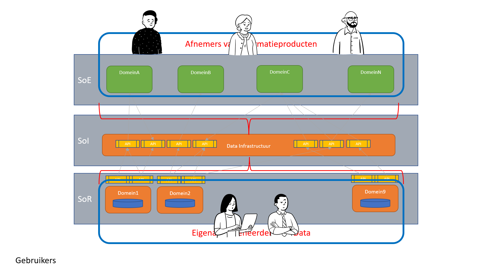

Gebruikers zijn in te delen in verschillende categorieën. Die categorieën passen op de 3 lagen van het pacelayermodel.
Geplot op de 3 lagen zitten in het SoR de 'producenten' van data. **Gebruikers in de SoR** hebben vaak specialistische applicaties waarmee de data wordt ingevoerd. Alles is gericht op een snelle en foutloze invoer van data. Opslag en uitwisselformaten van data zijn ook gericht op kwaliteit.

**Gebruikers in het SoE** zijn echte afnemers van informatie. Data wordt door hen niet bewerkt. Denk aan de gebruikers van een viewer, of de lezers van een rapport.

In het SoI wordt data verwerkt tot informatie. Data uit één of meerdere bronnen wordt gevalidideerd, gecombineerd, gefilterd, geaggregeerd, er vinden berekeningen plaats, er zijn modellen. Het resultaat is een informatieproduct. **Gebruikers in het SoI** zijn data-analisten, data-scientists, leveranciers, enz..  

Samengevat: Gebruikers komen in alle 3 lagen van het paceayer model voor, maar elk van de 3 lagen kent zijn eigen specifieke gebruikers. 

### Informatiemodellen
Informatiemodellen zorgen ervoor dat iedereen elkaar begrijpt. Het begint bij een gemeenschappelijke begrippenlijst. Het [Metamodel voor Informatiemodellering (MIM)](https://docs.geostandaarden.nl/mim/mim/) beschrjft een standaard aanpak voor het modelleren van informatie. [MIM](#mim-principes) onderkent 4 lagen in een informatiemodel. Het hoogste niveau is de begrippenlijst, het 'woordenboek' waarin de ondeling afgesproken begrippen staan. Daaronder komt het conceptueel informatiemodel. Onder het conceptueel informatiemodel komt het logisch of gegevensmodel. Als onderste laag het fysiek datamodel.

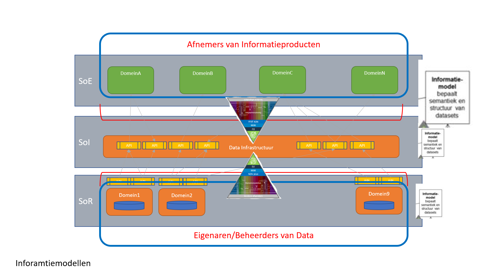

In de 3 lagen van het pacelayer model zal het van onder naar boven eerst over datamodellen in de onderste laag (het SoR) gaan, in de middelste laag is het belangrijk dat er gebruik gemaakt wordt van een semantische laag (op elkaar afgestemde begrippen), die in de bovenste laag worden gebruikt. 

Lees meer over de geo-standaarden voor [Informatiemodellen](#informatiemodellen-0) in dit Raamwerk.

### Coördinaatreferentiesystemen

Coördinaatreferentiesystemen (CRS) komen in alle 3 de pacelayers voor. Er wordt data geregistreerd in een bepaald CRS, bijvoorbeeld het [rijksdriehoekstelsel (RD)](https://www.nsgi.nl/rijksdriehoeksmeting). Data wordt getransformeerd naar een CRS, bijvoorbeeld [WGS 84](https://docs.geostandaarden.nl/crs/crs/#wgs-84) of [ETRS89](https://docs.geostandaarden.nl/crs/crs/#europese-crs-en-etrs89-en-evrs). Data wordt geserveerd in een bepaald CRS. Dát er in verschillende CRS'en wordt geregistreerd is helemaal niet erg, zolang er maar wel gebruik gemaakt wordt van een standaard omrekening. 

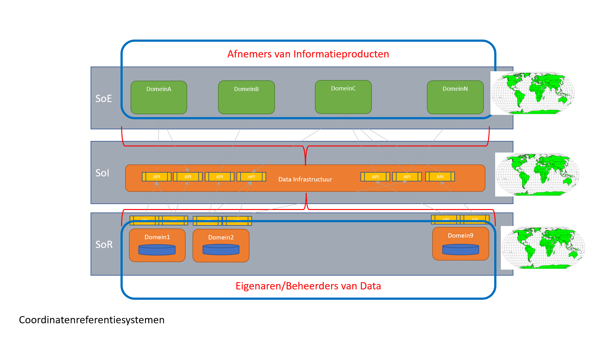

Lees meer over de geo-standaarden voor [Coördinaatreferentiesystemen](#coördinaat-referentiesystemen) in dit Raamwerk.

### Data
Data is een representatie van observaties, objecten of andere entiteiten uit de werkelijkheid. Data refereert naar iets (een object) dat is verzameld, geobserveerd of gemeten. Zodra data wordt bewerkt (gekoppeld met andere data, geaggregeerd, gefilterd, berekend, enz.) ontstaat Informatie. En Informatie wordt door de mens gebruikt als een basis om beslissingen te nemen.

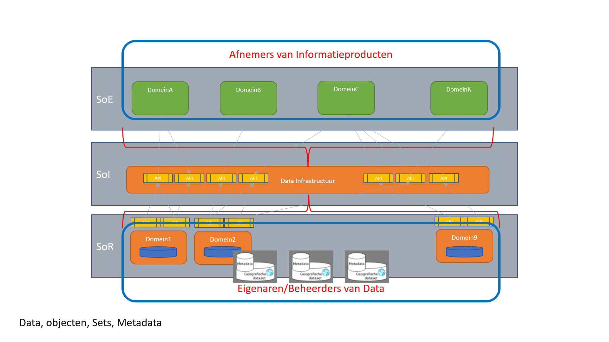

Data wordt gegenereerd in het SoR, data is het 'erts' van de informatieproducten. Data gaat veel langer mee dan applicaties, en moet dus ook los van applicaties kunnen bestaan. Daarom is een open data principe ook zo belangrijk. Aan data die 'opgesloten' zit heeft niemand wat. Data moet een eigenaar kennen, iemand of een organisatie die bepaalt welke data wordt vastgelegd, aan welke kwaliteitseisen de data moet voldoen, én wat er met de data mag gebeuren. Data wordt voor een bepaald doel ingewonnen, en moet ook voor dat doel worden gebruikt. Dat noemen we doelbinding. 

Data wordt in het SoI bewerkt tot informatieproducten. Typische bewerkingen zijn: het maken van een selectie, agrregatie, combinatie of een berekening. De informatieproducten beantwoorden een vraag van een afnemer, dat noemen we vraagestuurd werken. Data kan statische data zijn (eenmalig ingewonnen en eenmalig vastgelegd en (bijna) nooit meer gewijzigd). Data kan transactionele data zijn (data die wordt vastgelegd als er 'iets' gebeurt, of gedaan moet worden met een object), Data kan (near)realtime zijn als het bijvoorbeeld door een sensor wordt ingewonnen en direct beschikbaar wordt gesteld. 

### Metadata
Metadata zijn data, die de karakteristieken van data beschrijven. Het zijn dus eigenlijk data over data. De metadata bij een bepaald document (de data) kunnen bijvoorbeeld zijn: de auteur, de datum van schrijven, de uitgever, het aantal pagina's en de taal waarin de data zijn opgesteld. De metadata helpt mens en computer bij het vinden van de juiste data en bij het juist interpreteren van het document. Er is een directe relatie met [FAIR](#fair-principes), en met [Vindbaarheid](#nora-nederlandse-overheids-referentie-architectuur) zoals [NORA](#nora-nederlandse-overheids-referentie-architectuur) definieert. Metadata is zo als het ware de 'wegwijzer' voor het vinden van data.

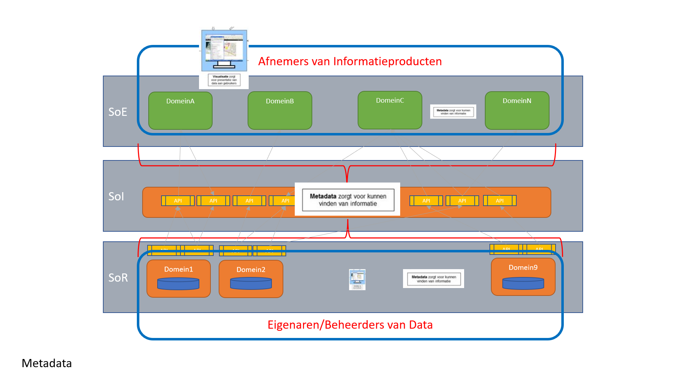

Metadata beschrijft ook 'wat' er met data is gebeurd om informatieproduct te worden: Hoe is de data ingewonnen, hoe is de data geregistreerd, heeft er een dataconversie plaatsgevonden, welke bewerkingen zijn er met de data gedaan, enz.. 

En belangrijk: _de één zijn data is de ander zijn meta-data en vice versa._

Lees meer over de geo-standaarden voor [Metadata](#metadata-0) in dit Raamwerk.

### API's
API's - Application Programming Interfaces zijn hét middel om data en applicaties te ontkoppelen. API's zitten tussen data, informatieproducten en applicaties in. De [Nederlandse API Strategie](https://www.forumstandaardisatie.nl/informatie-aanbieden-apis) beschrijft drie soorten API's. De system API's die dicht tegen de data objecten aanzitten, de orchestratation API's die meerdere system API's aan elkaar koppelen, en tenslotte de convenience API's die kunnen worden aangeroepen vanuit het [SoE](#het-3-laags-pacelayer-model). 

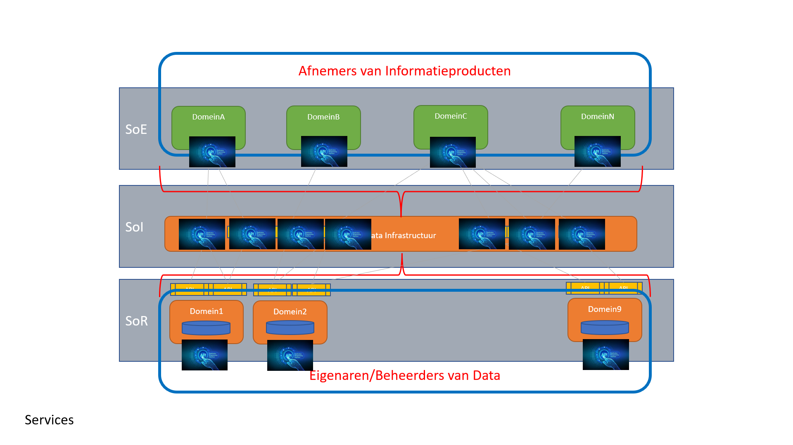

Lees meer over de geo-standaarden voor [API's](#application-programming-interfaces) in dit Raamwerk.
