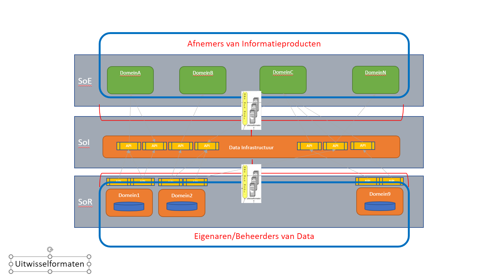

# Geo-standaarden in samenhang

**Het doel van het Raamwerk van geo-standaarden is om uit de grote verscheidenheid aan standaarden die er zijn voor geo-informatie, die set te kiezen die past bij de doelen die je voor ogen staan. Er zijn verschillende standaarden voor het vindbaar, toegankelijk, uitwisselbaar en herbruikbaar maken van geodata. Elke standaard speelt een eigen rol. In samenhang toegepast, ontstaat een geo-informatie infrastructuur.**

In dit hoofdstuk wordt belangrijke context voor het gebruik van geo-standaarden beschreven, evenals de samenhang tussen de geo-standaarden. Vanuit de nationale geo-informatie infrastructuur wordt inzicht gegeven in de wereld van de internationale standaarden, die richtinggevend zijn voor de Nederlandese geo-standaarden. De nationale geo-informatie infrastructuur voldoet tevens aan de FAIR principes, hetgeen hier niet onvermeld mag blijven. De Nederlandse geo-standaarden maken deel uit van de Nederlandse architectuur (NORA) en de Nederlandse (BOMOS). De samenhang

**Nationale geo-informatie infrastructuur**

Om geo-informatie zo laagdrempelig mogelijk te ontsluiten is in Nederland de afgelopen jaren gewerkt aan een Nationale Geo-Informatie Infrastructuur (NGII). De NGII als concept is het geheel van geo-informatie(bronnen), metadata, standaarden, voorzieningen, netwerkdiensten, organisatie en afspraken voor de efficiënte uitwisseling van en toegang tot geo-informatie. 

De NGII ontwikkelt zich van een infrastructuur die laagdrempelig toegang biedt tot individuele databronnen, tot een infrastructuur van data die je in samenhang kunt bevragen. Het belang van zowel semantische als technische interoperabiliteit neemt om deze reden steeds verder toe. In de Whitepaper Visie op upgrade Nederlandse Geo-informatie Infrastructuur(NGII) is de ontwikkeling van de NGII richting een vraaggedreven infrastructuur beschreven. 
Data zijn een essentiële grondstof voor het maken van keuzes. In Europa vinden we het daarbij belangrijk dat keuzeprocessen transparant zijn. Burgers moeten overheidsbeleid kunnen controleren en er zelf actief aan kunnen bijdragen met nieuwe initiatieven of alternatieven. Openheid, authenticiteit, herleidbaarheid zijn daarom belangrijke aandachtspunten bij het door ontwikkelen van de infrastructuur.

"De Nederlandse Geo-informatie Infrastructuur is toe aan een upgrade” schreven we in de Geonovum meerjarenvisie 2021-2023. Hoe kan de NGII een upgrade krijgen richting een vraaggedreven infrastructuur, die de kracht van locatiedata laagdrempelig inzetbaar maakt voor de grote maatschappelijke opgaven? Welke (nieuwe) standaarden spelen daarbij een rol? Hoe hangen allerlei afzonderlijke ontwikkelingen eigenlijk met elkaar samen? En hoe verhoudt de NGII 2.0 zich bijvoorbeeld tot een Nationale Digital Twin Infrastructuur? En hoe verhouden die ontwikkelingen zich toch Europese ontwikkelingen rond data en digitalisering? In een [Whitepaper Visie op upgrade Nederlandse Geo-informatie Infrastructuur(NGII)](https://docs.geostandaarden.nl/ngii/wpungii/) zijn de antwoorden gezocht op die vragen. En omdat die antwoorden meer waarde hebben, wanneer ze breed gedragen worden in het werkveld, is dit white paper ook in publieke consulatie gebracht en vervolgens aangescherpt. 

## FAIR

Op eenduidige wijze samenwerken om informatie zo beter te kunnen beveiligen, makkelijker uit te wisselen en toegankelijker te maken voor iedereen. Dat is hoe open standaarden de samenwerking bevorderen tussen de overheid, burger en het bedrijfsleven. De [FAIR Principes](https://www.go-fair.org/fair-principles/) zijn een hulpmiddel daarin: het doel van de principes is het hergebruik van waardevolle data mogelijk maken. De FAIR Principes dwingen geen standaarden af, maar moedigen communities aan om data en diensten vindbaar, toegankelijk, interoperabel en herbruikbaar te maken.  

De geo-standaarden maken geo-informatie FAIR: De verbindende kracht van standaardisatie in vindbare, toegankelijke, uitwisselbare en herbruikbare geo-informatie: 
- **Findable** (vindbaar). De eerste stap bij het (her)gebruiken van data is om de data te vinden. Metadata en data moeten gemakkelijk te vinden zijn voor zowel mensen als computers. Machine-readable metadata zijn essentieel voor het ontdekken van data.
- **Accessible** (toegankelijkheid). Zodra de gebruiker de benodigde data heeft gevonden, moet de gebruiker weten hoe deze kunnen worden geraadpleegd, inclusief het verkrijgen van toegang (authenticatie en autorisatie).
- **Interoperable** (interoperabel). De data moeten meestal worden geïntegreerd met andere data. Bovendien moeten de data samenwerken met applicaties of workflows voor analyse, opslag en verwerking.
- **Reusable** (herbruikbaar), Het uiteindelijke doel van FAIR is het hergebruik van data te optimaliseren. Om dit te bereiken moeten metadata en data goed worden beschreven, zodat ze in verschillende situaties kunnen worden gerepliceerd en/of gecombineerd.

## Internationale standaarden
Voor onze nationale geo-standaarden geldt dat deze ontwikkeld zijn op basis van Europese en internationale standaarden, aangevuld met de voor Nederland geldende specifieke eisen. Op het moment dat een nationale standaard is ontwikkeld, geldt dat een nationale standaard leidend is. Is er geen nationale standaard, dan geldt de Europese standaard en als er geen Europese standaard is, geldt een internationale, wereldwijde standaard.
Internationaal zijn voor Nederland de standaarden afkomstig van standaardisatie organisaties [ISO/TC 211  Geographic information/Geomatics](https://www.iso.org/committee/54904.html), het [Open Geospatial Consortium](https://www.ogc.org/) (OGC) en het [World Wide Web Consortium](https://www.w3.org/) (W3C) van groot belang. ISO/TC211 en het OGC maken technische geo-standaarden, die Nederland semantisch en technisch invult. Deze geo-standaarden organisaties hebben liaisons met de algemene ICT en Internet standaardisatie organisaties zoals het W3C. Geonovum participeert namens Nederland actief in deze drie internationale standaardisatie organisaties.

Vanuit Europa zijn onder meer de standaarden relevant die vallen onder de Europese [INSPIRE](https://inspire.ec.europa.eu/) kaderrichtlijn. Deze richtlijn beschrijft technische afspraken die uitwisseling van geodata mogelijk maakt over 34 thema’s met betrekking tot de leefomgeving. De INSPIRE richtlijn geldt voor data van overheidsdiensten van Europese lidstaten. De INSPIRE standaarden zijn gebaseerd op internationale geo-standaarden voor het vinden, bekijken en downloaden van geodata. De INSPIRE data specificaties voor de thema’s hebben een duidelijke relatie met de informatiemodellen voor verschillende domeinen en sectoren in Nederland. 

Tot slot zijn er ook specifiek Nederlandse profielen. Deze zijn gebaseerd op of opgelijnd met de internationale en Europese profielen. Het deel van de Nederlandse geo-standaarden profielen dat zorgt voor het functioneren van de nationale geo-informatie infrastructuur heeft een aparte positie op de ['pas toe of leg uit'](https://www.forumstandaardisatie.nl/open-standaarden) lijst van verplichte open standaarden van het Forum Standaardisatie van de Nederlandse digitale overheid. Deze geo-standaarden zijn van primair belang in het aansluiten van geo-informatie op de digitale overheid (voorheen e-overheid).

## NORA - Nederlandse Overheids Referentie Architectuur

De geo-standaarden moeten passen binnen de architectuur van organisaties. Aangezien dat meestal overheden zijn, gaan we wat dieper in op de [Nederlandse Overheids Referentie Architectuur](https://www.noraonline.nl/) (NORA). 

De Basisprincipes van NORA bestaan uit [Kwaliteitsdoelen](https://www.noraonline.nl/wiki/Kwaliteitsdoelen) en de Afgeleide Principes zijn omgezet naar [Architectuurprincipes](https://www.noraonline.nl/wiki/Architectuurprincipes). Een overzicht van de Kernwaarden, Kwaliteitsdoelen en Beleidskaders vind je op [NORAonline](https://www.noraonline.nl/wiki/Grafisch_overzicht_relaties_Kernwaarden_en_Kwaliteitsdoelen_met_Beleidskaders). Principes als [Vindbaarheid](https://www.noraonline.nl/wiki/Vindbaar_(Doel)), [Toegankelijkheid](https://www.noraonline.nl/wiki/Toegankelijk_(Doel)) en [Transparantie](https://www.noraonline.nl/wiki/Transparant_(Doel)) zijn belangrijk in NORA.

NORA stelt ook de “[pas-toe-of-leg-uit](https://www.forumstandaardisatie.nl/open-standaarden)” lijst van het Forum Standaardisatie verplicht. Dit is de lijst met open standaarden waar Nederlandse overheden en organisaties uit de publieke sector alleen beredeneerd van af kunnen wijken als zij IT systemen aanschaffen. De basisset met generieke [geo-standaarden](https://www.forumstandaardisatie.nl/open-standaarden/geo-standaarden) staat ook op de pas-toe-of-leg-uit lijst. De vermelding op deze lijst draagt bij aan de 'verankering' van de geo-standaarden en geo-informatie infrastructuur in de nationale digitale overheid.

## BOMOS

Geonovum heeft het beheer van alle geo-standaarden ingericht langs de lijnen van het [Beheer- en Ontwikkelmodel voor Open Standaarden](https://www.logius.nl/diensten/bomos) (BOMOS). BOMOS is in beheer bij het Centrum voor Standaarden bij [Logius](https://www.logius.nl/diensten/bomos). 
Geonovum gebruikt BOMOS voor alle standaarden die het in beheer heeft, om te garanderen dat deze open zijn volgens de definitie die BOMOS hieraan geeft. De toepassing van BOMOS zorgt er bovendien voor dat standaarden die Geonovum beheert en ontwikkelt in aanmerking komen voor plaatsing op de lijst verplichte standaarden en op de lijst met aanbevolen standaarden van het Forum Standaardisatie. 

 
Hoe wij binnen Geonovum BOMOS gebruiken staat beschreven in onze [beheerdocumentatie voor de geo-standaarden](https://docs.geostandaarden.nl/gbd/gsb/).

## Het 3-laags pacelayer model

Het 3-laags pacelayermodel waarin de bovenstaande principes worden gebruikt is gebaseerd op het 3-laags pacelayermodel van Gartner, het [5-lagenmodel van Common Ground](https://componentencatalogus.commonground.nl/5-lagen-model) en het 5-lagenmodel van [NORA](https://www.noraonline.nl/wiki/Vijflaagsmodel). 

Het 3-lagenmodel (gebaseerd op het Gartnermodel) ontkoppelt data en applicaties, data-silo's komen in het model niet voor, er wordt een duidelijk onderscheid gemaakt tussen data en informatie, en het bijhouden van data, het bewerken van data tot informatie en het gebruiken van de informatieprodcuten. De 3 lagen in dit model zijn Het System of Records (SoR), het System of Integration (SoI) en het System of Engagement (SoE).

In het **System of Records** of Registratie vind de registratie van data plaats. Bij registreren is datakwaliteit heel belangrijk. De data-eigenaar (zie DAMA) bepaalt welke data worden geregistreerd bij een object, en aan welke kwaliteitseisen (zie DAMA) de data moeten voldoen. 
In de laag **System of Integration** of Integratie worden data gecombineerd en/of verwerkt tot informatieproducten. Op die manier ontstaat een integraal beeld over de verschillenden objecten. De data eigenaar bepaalt wat er met de data kan en mag gebeuren. Daarbij zijn principes als datakwaliteit belangrijk, maar ook (data)privacy en (data)security zijn hier belangrijk.
In de laag **System of Engagement** of distributie worden de informatieproducten uit de SoI gebruikt en gepresenteerd aan de afnemers van die informatieproducten. 
Om ontkoppeling tussen data en applicaties te bewerkstelligen vindt alle 'transport' van data en informatie plaats via API's - Application Programming Interface's. Er is een API-Strategie voor de Nederlandse Overheid.

## Het Raamwerk Geo-standaarden geplot op het pacelayermodel
In deze paragraaf worden de verschillende categorieën geo-standaarden 'geplot' op het pacelayermodel. Dat geeft meteen een indicatie van 'waar' in het landschap een bepaalde categorie geo-standaarden een rol speelt. In de paragrafen in dit hoofdstuk wordt een korte toelichting gegeven van de geo-standaarden en waarom ze in één of meer lagen van het pacelayermodel zijn opgenomen. 

### Gebruikers
De gebruikers zijn de belangrijkste onderdelen van de architectuurplaat. Immers daar doen we het allemaal voor. De architectuur en alle onderdelen zijn erop gericht om een goede informatieverstrekking te kunnen doen. Informatie waarop beslissingen worden gebaseerd. Gebruikers kunnen op allerlei verschillende manieren toegang krijgen tot de informatie. Denk hierbij aan viewers, dashboards, rapportages enz.. Het medium maakt niet uit, zolang er maar dezelfde informatie wordt gegeven.

Gebruikers zijn in te delen in verschillende categorieën. Die categorieën passen op de 3 lagen van het pacelayermodel.
Geplot op de 3 lagen zitten in het SoR de 'producenten' van data. **Gebruikers in de SoR** hebben vaak specialistische applicaties waarmee de data wordt ingevoerd. Alles is gericht op een snelle en foutloze invoer van data. Opslag en uitwisselformaten van data zijn ook gericht op kwaliteit.

**Gebruikers in het SoE** zijn echte afnemers van informatie. Data wordt door hen niet bewerkt. Denk aan de gebruikers van een viewer, of de lezers van een rapport.

In het SoI wordt data verwerkt tot informatie. Data uit één of meerdere bronnen wordt gevalidideerd, gecombineerd, gefilterd, geaggregeerd, er vinden berekeningen plaats, er zijn modellen. Het resultaat is een informatieproduct. **Gebruikers in het SoI** zijn data-analisten, data-scientists, leveranciers, enz..  

Samengevat: Gebruikers komen in alle 3 lagen van het paceayer model voor, maar elk van de 3 lagen kent zijn eigen specifieke gebruikers. 

### Informatiemodellen
Informatiemodellen zorgen ervoor dat iedereen elkaar begrijpt. Het begint bij een gemeenschappelijke begrippenlijst. Het [Metamodel voor Informatiemodellering (MIM)](https://docs.geostandaarden.nl/mim/mim/) beschrjft een standaard aanpak voor het modelleren van informatie. [MIM](#mim-principes) onderkent 4 lagen in een informatiemodel. Het hoogste niveau is de begrippenlijst, het 'woordenboek' waarin de ondeling afgesproken begrippen staan. Daaronder komt het conceptueel informatiemodel. Onder het conceptueel informatiemodel komt het logisch of gegevensmodel. Als onderste laag het fysiek datamodel.

In de 3 lagen van het pacelayer model zal het van onder naar boven eerst over datamodellen in de onderste laag (het SoR) gaan, in de middelste laag is het belangrijk dat er gebruik gemaakt wordt van een semantische laag (op elkaar afgestemde begrippen), die in de bovenste laag worden gebruikt. 

Lees meer over de geo-standaarden voor [Informatiemodellen](#informatiemodellen-0) in dit Raamwerk.

### Uitwisselformaten
Uitwisselformaten zijn gebaseerd op de Informatiemodellen en zorgen ervoor dat data uitgewisseld kan worden tussen de verschillende systemen onderling. In de architectuurplaten bevinden de uitwisselformaten zich tussen de verschillende lagen. Uitwisselformaten zullen door [API's](#application-programming-interfaces) worden gebruikt om te bepalen wat er dor die API's wordt geleverd. 

Lees meer over de geo-standaarden voor [Uitwisselformaten](#uitwisselformaten) in dit Raamwerk.

### Coördinaatreferentiesystemen

Coördinaatreferentiesystemen (CRS) komen in alle 3 de pacelayers voor. Er wordt data geregistreerd in een bepaald CRS, bijvoorbeeld het [rijksdriehoekstelsel (RD)](https://www.nsgi.nl/rijksdriehoeksmeting). Data wordt getransformeerd naar een CRS, bijvoorbeeld [WGS 84](https://docs.geostandaarden.nl/crs/crs/#wgs-84) of [ETRS89](https://docs.geostandaarden.nl/crs/crs/#europese-crs-en-etrs89-en-evrs). Data wordt geserveerd in een bepaald CRS. Dát er in verschillende CRS'en wordt geregistreerd is helemaal niet erg, zolang er maar wel gebruik gemaakt wordt van een standaard omrekening. 

Lees meer over de geo-standaarden voor [Coördinaatreferentiesystemen](#coördinaat-referentiesystemen) in dit Raamwerk.

### Data
Data is een representatie van observaties, objecten of andere entiteiten uit de werkelijkheid. Data refereert naar iets (een object) dat is verzameld, geobserveerd of gemeten. Zodra data wordt bewerkt (gekoppeld met andere data, geaggregeerd, gefilterd, berekend, enz.) ontstaat Informatie. En Informatie wordt door de mens gebruikt als een basis om beslissingen te nemen.

Data wordt gegenereerd in het SoR, data is het 'erts' van de informatieproducten. Data gaat veel langer mee dan applicaties, en moet dus ook los van applicaties kunnen bestaan. Daarom is een open data principe ook zo belangrijk. Aan data die 'opgesloten' zit heeft niemand wat. Data moet een eigenaar kennen, iemand of een organisatie die bepaalt welke data wordt vastgelegd, aan welke kwaliteitseisen de data moet voldoen, én wat er met de data mag gebeuren. 

Data wordt in het SoI bewerkt tot informatieproducten. Typische bewerkingen zijn: het maken van een selectie, agrregatie, combinatie of een berekening. De informatieproducten beantwoorden een vraag van een afnemer, dat noemen we vraagestuurd werken. Data kan statische data zijn (eenmalig ingewonnen en eenmalig vastgelegd en (bijna) nooit meer gewijzigd). Data kan transactionele data zijn (data die wordt vastgelegd als er 'iets' gebeurt, of gedaan moet worden met een object), Data kan (near)realtime zijn als het bijvoorbeeld door een sensor wordt ingewonnen en direct beschikbaar wordt gesteld. 

### Metadata
Metadata zijn data, die de karakteristieken van data beschrijven. Het zijn dus eigenlijk data over data. De metadata bij een bepaald document (de data) kunnen bijvoorbeeld zijn: de auteur, de datum van schrijven, de uitgever, het aantal pagina's en de taal waarin de data zijn opgesteld. De metadata helpt mens en computer bij het vinden van de juiste data en bij het juist interpreteren van het document. Er is een directe relatie met [FAIR](#fair-principes), en met [Vindbaarheid](#nora-nederlandse-overheids-referentie-architectuur) zoals [NORA](#nora-nederlandse-overheids-referentie-architectuur) definieert. Metadata is zo als het ware de 'wegwijzer' voor het vinden van data.

Metadata beschrijft ook 'wat' er met data is gebeurd om informatieproduct te worden: Hoe is de data ingewonnen, hoe is de data geregistreerd, heeft er een dataconversie plaatsgevonden, welke bewerkingen zijn er met de data gedaan, enz.. 

En belangrijk: _de één zijn data is de ander zijn meta-data en vice versa._

Lees meer over de geo-standaarden voor [Metadata](#metadata-0) in dit Raamwerk.

### API's
API's - Application Programming Interfaces zijn hét middel om data en applicaties te ontkoppelen. API's zitten tussen data, informatieproducten en applicaties in. De [Nederlandse API Strategie](https://www.forumstandaardisatie.nl/informatie-aanbieden-apis) beschrijft drie soorten API's. De system API's die dicht tegen de data objecten aanzitten, de orchestratation API's die meerdere system API's aan elkaar koppelen, en tenslotte de convenience API's die kunnen worden aangeroepen vanuit het [SoE](#het-3-laags-pacelayer-model). 

Lees meer over de geo-standaarden voor [API's](#application-programming-interfaces) in dit Raamwerk.
