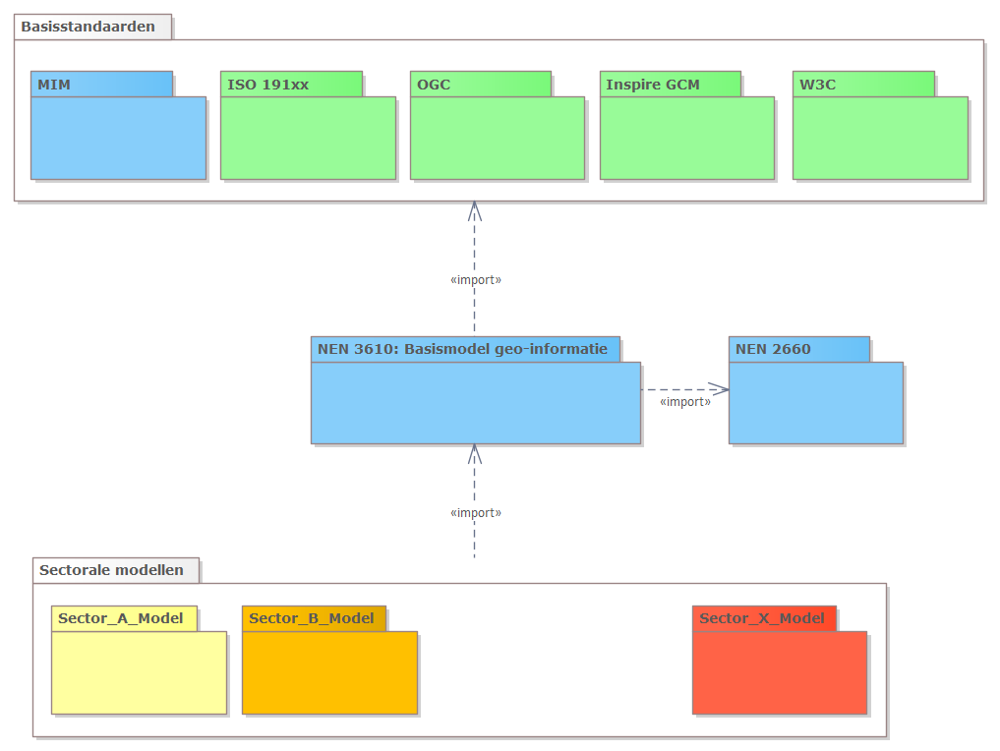

# Informatiemodellen

**Een informatiemodel zet afspraken over begrippen en definities binnen een bepaald domein op een rij. Doordat alle partijen binnen het domein deze afspraken volgen, is het mogelijk om data van de verschillende partijen (door de tijd heen) te vergelijken, uit te wisselen en te hergebruiken. Dit vereenvoudigt de uitwisseling en hergebruik van informatie. In dit hoofdstuk beschrijven we de geo-standaarden die de basis vormen van de informatiemodellen en beschrijvingen van geo-informatie.**

<figure id="pd1">

<figcaption>Informatiemodellen</figcaption>
</figure>

> Denk bij het maken, gebruiken of doorontwikkelen van informatiemodellen aan de volgende onderwerpen:
  - Voor Informatiemodellen gebaseerd op NEN 3610: Doe een NEN3610 Conformiteitstoets.
  - Structureer je informatiemodel conform MIM, denk aan Begrippenkaders en het verschil tussen een Conceptueel- en een Logisch Informatiemodel.
  - Ontwerp een informatiemodel vanuit de gedachte van samenhang. Kijk naar hergebruik van Objecttypen en het verwijzen naar bestaande begrippenkaders. 

## NEN 3610 - Basismodel voor informatiemodellen

NEN 3610 is het basismodel voor geo-informatiemodellen. Informatiemodellen, ook wel dataspecificaties genoemd, specificeren de inhoud van datasets of dataservices. NEN 3610 geeft regels voor het eenduidig beschrijven, uitwisselen van geo-informatie binnen de geo-informatie infrastructuur. 

De focus van de NEN 3610 ligt op semantische interoperabiliteit. Semantische interoperabiliteit wordt gerealiseerd door het harmoniseren van termen en definities die  verschillende sectoren hanteren. Dit draagt bij aan de interoperabiliteit van data over de grenzen van verschillende sectoren heen. Aanvullend op de semantiek biedt NEN 3610 een gemeenschappelijke reeks van regels, concepten en modelleerpatronen waarlangs je de geografische werkelijkheid modelleert. 
NEN 3610 positioneert informatiemodellen in het bredere kader van een open en toegankelijke semantische architectuur bestaande uit begrippenkaders, informatiemodellen, ontologieën en daarvoor ontworpen registers.
De gebruiker van NEN 3610 is de informatiearchitect en informatiemodelleur, die georegistraties en bijbehorende informatiemodellen ontwerpen.

## Samenhang internationale en nationale standaarden

NEN 3610 is afgestemd op en gerelateerd aan internationale standaarden. Belangrijk om te vermelden, is dat de structuur en opbouw van NEN 3610 conformeert aan de ISO 19100 serie. Aan deze ISO standaard moet geo-informatie voldoen in het kader van Europese regels (INSPIRE). Door de internationale afstemming is de structuur en opbouw van de Nederlandse informatiemodellen conform NEN 3610, vergelijkbaar met die van Europese standaarden. De Europese INSPIRE standaarden zijn geïmplementeerd aan de hand van 34 inhoudelijke thema’s, waarvoor 'dataspecificaties' zijn opgesteld. Nederlandse datasets, die onder INSPIRE vallen, worden conform deze Europese dataspecificaties aan de Europese geo-informatie infrastructuur beschikbaar gesteld.

NEN 3610 heeft ook een relatie met de [NEN 2660:2022](https://www.nen.nl/en/nen-2660-2-2022-nl-291667) die regels geeft voor informatiemodellering van de gebouwde omgeving. Beide zijn op elkaar afgestemd. Onderstaande figuur 3.1 geeft schematisch de relaties tussen overkoepelende standaarden, NEN 3610 en sectorale  informatiemodellen weer.

<figure id="pd-package">

<figcaption>UML Packagediagram van relatie tussen nationale -, internationale standaarden – NEN 3610 – sectorale modellen</figcaption>
</figure>

Met het «import» statement wordt bedoeld dat een afhankelijkheid is tussen standaarden. NEN 3610 gebruikt bijvoorbeeld het MIM metamodel, afspraken uit ISO 19103 voor het gebruik van UML als modelleertaal, het geometriemodel uit ISO 19107, XML en linked data afspraken van W3C, het netwerkmodel uit INSPIRE Generic Conceptual Model (GCM). Sectorale modellen hergebruiken weer de NEN 3610 toepassing daarvan. In figuur 3.2 wordt de deze relatie tussen de verschillende kaders van standaarden in de NEN 3610 pyramide met domeinmodellen (de sectorale informatiemodellen) weergegeven.  

<figure id="pd-piramide">

<figcaption>Vorige figuur weergegeven in de 'NEN 3610 piramide'</figcaption>
</figure>

## MIM - Metamodel voor Informatiemodellering

Het Metamodel voor informatiemodellering [[MIM]] is een standaard die het metamodel beschrijft waarmee informatiemodellen – ook voor andere dan geo-informatie - worden gemaakt. Het beschrijft de metaklassen, metastructuur en metagegevens die de grondslag vormen voor een informatiemodel. Doel van MIM is het standaardiseren van de methode van informatiemodelleren. Hierdoor wordt afstemming tussen informatiemodellen, vergelijkbaarheid in publicatie en gebruik van gemeenschappelijke tooling mogelijk. Conformiteit aan MIM faciliteert het ontstaan van een overheidsbreed stelsel van vergelijkbare en samenhangende informatiemodellen. 
Het MIM metamodel is conceptueel beschreven en uitgewerkt voor toepassing in UML en in Linked Data. 

Om NEN 3610 informatiemodellen interoperabel te maken in de context van de digitale overheid, gebruikt NEN 3610 als metamodel de Nederlandse standaard voor meta-informatiemodellering. NEN 3610 conformeert aan MIM.

## Overzicht standaarden informatiemodellen voor Nederland

NEN 3610 is de basis van waaruit verschillende sectorale informatiemodellen nader zijn uitgewerkt. Zo zijn er modellen voor de toepassingsdomeinen water (IMWA), openbare ruimte (IMBOR, IMSW), milieu (IMGeluid, IMAER), natuurbeheer (IMNA), verkeer en vervoer (IMWV,) kabels en leidingen (IMKL) en openbare orde en veiligheid (IMOOV, IMDBK, IMEV). Ook enkele nationale basisregistraties maken deel uit van de NEN 3610 familie, zoals de basisregistraties adressen en gebouwen (BAG/IMBAG), grootschalige topografie (BGT/IMGEO), topografie (BRT/IMTOP), kadastrale percelen, (BRK/IMKAD) en ondergrond (BRO/IMBRO). Elk van deze informatiemodellen fungeert als een standaard voor het uitwisselen van geo-informatie binnen die sector of domein (de toepassingsprofielen). De documentatie over de sectormodellen gebaseerd op NEN 3610 is te vinden in het [Overzicht geo-standaarden](https://www.geonovum.nl/geo-standaarden/alle-standaarden).

*Tabel 3.1 - Standaarden en specificaties met betrekking tot informatiemodellen*

<table>
  <colgroup>
  <col style= "width: 34%;" >
  <col style= "width: 33%;" >
  <col style= "width: 33%;" >
   </colgroup>
  <thead>
    <tr>
      <th> Internationale standaarden en specificaties </th>
      <th> Europese profielen </th>
      <th> Nederlandse profielen </th>
    </tr>
  </thead>
  <tbody>
    <tr>
      <td>ISO 19101 Geographic Information – Reference model [[iso19101]] </td>
      <td>INSPIRE: Generic Conceptual Model [[inspire-gcm]] </td>
      <td>MIM - Metamodel Informatie Modellering versie 1.2 [[MIM]] </td>
     </tr>
    <tr>
      <td>ISO/TS 19103 Geographic Information - Conceptual schema language [[iso19103]] </td>
      <td>INSPIRE: Methodology for the development of data specifications [[inspire-mds]] </td>
      <td>NEN 3610:2022 Basismodel Geo-informatie. [[NEN3610]] </td>
     </tr>
    <tr>
      <td>ISO 19107 Geographic information - Spatial Schema [[iso19107]] </td>
      <td> </td>
      <td>SBB: Standaard voor het Beschrijven van Begrippen [[SBB]]</td>
     </tr>
    <tr>
      <td>ISO 19108 Geographic information - Temporal Schema [[iso19108]] </td>
      <td> </td>
      <td> </td>
     </tr>
    <tr>
      <td>ISO 19109 Geographic information - Rules for application schema [[iso19109]] </td>
      <td> </td>
      <td> </td>
     </tr>
    <tr>
      <td>ISO 19110 Geographic information - Methodology for feature cataloguing [[iso19110]] </td>
      <td> </td>
      <td> </td>
     </tr>
    <tr>
      <td>ISO 19118 Geographic Information – Encoding [[iso19118]]</td>
      <td> </td>
      <td> </td>
     </tr>
    <tr>
      <td>ISO 19131 Geographic Information - Data product specification [[iso19131]] </td>
      <td> </td>
      <td> </td>
     </tr>
    <tr>
      <td>ISO 19136 Geographic Information - Geography Markup Language (GML) [[iso19136]] </td>
      <td> </td>
      <td> </td>
     </tr>
    <tr>
      <td>OGC Observations, measurements and samples version 3.0 [[OMS3]] </td>
      <td> </td>
      <td> </td>
     </tr>
    <tr>
      <td>OGC Observations and Measurements - XML Implementation 2.0 [[OaMx2]] </td>
      <td> </td>
      <td> </td>
     </tr>
    <tr>
      <td>OGC Timeseries Profile of Observations and Measurements 1.0 [[OaMt1]] </td>
      <td> </td>
      <td> </td>
     </tr>
    <tr>
      <td>OGC City Geography Markup Language (CityGML) Part 1: Conceptual Model Standard version 3.0 [[CityGML3]] </td>
      <td> </td>
      <td> </td>
     </tr>
    <tr>
      <td> </td>
      <td>INSPIRE Data specifications </td>
      <td>Nederlandse toepassingsprofielen </td>
    </tr>
  </tbody>
</table>

## Afstemming begrippenkaders
Afstemming tussen begrippenkaders verhoogt de effectiviteit van informatievoorziening. Er is een aantal mechanismen om die afstemming te sturen:

- NEN 3610 heeft een semantisch model dat de werkelijkheid indeelt naar generieke begrippen (of UML superklassen) van reëel object en virtuele ruimte, met daaronder een verdeling naar bijvoorbeeld bodem, water, begroeiing, functionele ruimte, juridische ruimte. Sectorale modellen zijn verplicht om hun begrippen hieraan te koppelen;
- Informatiemodellen publiceren hun begrippen in registers. Registers worden via het web ontsloten. Begrippenkaders en registers voldoen aan de Standaard voor het Beschrijven van Begrippen [[SBB]]. De [NEN3610 conceptenbibliotheek](https://definities.geostandaarden.nl/nl/) is een voorbeeld van een register met begrippenkaders die voldoen aan de SBB standaard;
- Zoek bij het (door-)ontwikkelen van sectorale modellen samenwerking en afstemming tussen sectorale modellen;
- Knowledge graphs kunnen helpen om begrippenkaders aan elkaar te verbinden.
- De standaard voor het Beschrijven van Begrippen [[SBB]] zorgt voor interoperabiliteit tussen gepubliceerde begrippenkaders en vergemakkelijkt de afstemming tussen begrippen kaders als ook het verwijzen naar elkaars begrippen. 

## Kwaliteit van informatiemodellen

Informatiemodellen zijn nog geen data en kunnen daarom alleen op conceptueel niveau op kwaliteit beoordeeld worden. Er zijn een aantal mechanismen om de kwaliteit te borgen:

- NEN 3610:2022 conformiteit. NEN 3610:2022 bevat een abstracte testsuite voor het testen van de conformiteit van een informatiemodel aan NEN 3610. De regels en aanbevelingen van NEN 3610 zijn daarin vertaald naar conformiteitsklassen;
- Er is een NEN 3610:2022 [template](https://register.geostandaarden.nl/?url=nen3610/index.html) beschikbaar voor UML modellering in Enterprise Architect;
- Publicatie en implementatie van een NEN 3610 model in implementatieschema's wordt ondersteund door tooling. In de tooling zit een test op MIM conformiteit;
- Er is een handreiking [Geometrie in model en GML](https://docs.geostandaarden.nl/nen3610/gimeg/) beschikbaar. Deze handreiking beschrijft de toepassing van geometrie in informatiemodellering en de implementatie daarvan in GML. Het is een ondersteuning voor de toepassing van het basismodel geo-informatie (NEN 3610) en GML. De handreiking geeft onder meer uitleg over welke geometrieën er zijn, Simple Feature profielen en transformatieregels voor het kunnen genereren van GML uit UML.
