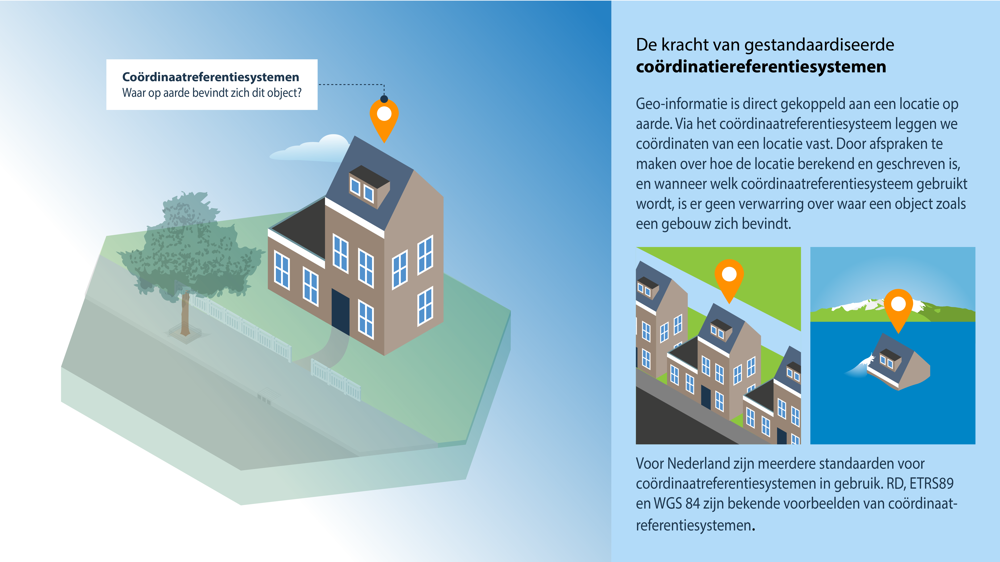

# Coördinaatreferentiesystemen

**Geo-informatie is direct gekoppeld aan een locatie op aarde. Via het coördinaatreferentiesysteem leggen we coördinaten van een locatie vast. Door afspraken te maken over hoe de locatie berekend en geschreven is, en wanneer welk coördinaatreferentiesysteem gebruikt wordt, is er geen verwarring over waar een object zoals een gebouw zich bevindt.
Voor Nederland zijn meerdere standaarden voor coördinaatreferentiesystemen in gebruik. RD, ETRS89 en WGS 84 zijn bekende voorbeelden van coördinaatreferentiesystemen.**

<figure id="pd6">

<figcaption>Coördinaatreferentiesystemen</figcaption>
</figure>

> Denk bij het maken, gebruiken of doorontwikkelen van informatiemodellen aan de volgende onderwerpen:
- Standaarden die opgesteld worden voor het Omgevingswet domein moeten RD ondersteunen (en uitwisselbaar zijn naar ETRS89)
- Fouten in het juist definieren van coordinaatsystemen of onjuist transformeren tussen coordinaatsystemen kunnen verstrekkende gevolgen hebben. 
- Niet elke analyse kan redelijkerwijs in elk coordinaatsysteem uitgevoerd worden, bijvoorbeeld omdat afstanden of oppervlaktes niet representatief hoeven te zijn in bepaalde coordinaatsystemen.

## Overzicht standaarden voor coördinaatreferentiesystemen

Een coördinaatreferentiesysteem (CRS) is opgebouwd uit een datum en een coördinatensysteem. Het coördinatensysteem definieert hoe coördinaten worden uitgedrukt, bijvoorbeeld cartesisch of geografisch. De datum geeft de relatie van het coördinatensysteem met de aarde. 

De in Nederland gebruikte coördinaatreferentiesystemen voor de opslag en uitwisseling van geo-informatie zijn onder te verdelen in verschillende groepen:

* **Geografische CRS-en** geven geografische coördinaten in graden (2D breedte en lengte (Engels: latitude en longitude) en voor 3D ook hoogte ten opzichte van een ellipsoïdisch model van het aardoppervlak;
* **Geprojecteerde CRS-en** presenteren geo-informatie op een plat vlak in cartesische (x en y) coördinaten. Een geprojecteerd CRS is een afgeleide van een geografisch CRS, waarbij voor het afbeelden in het platte vlak een kaartprojectie wordt gebruikt;
* **Verticale CRS-en** voor de vastlegging van hoogte en diepte ten opzichte van een referentievlak. Dit referentievlak is vaak gebaseerd op de richting van de zwaartekracht en valt normaal gesproken niet samen met oppervlak van een ellipsoïde;
* **Samengestelde CRS-en** (in het Engels 'Compound CRS') zijn samengestelde CRS-en, bijvoorbeeld samengesteld uit een geprojecteerde CRS en een verticale CRS.

Voor de definitie van CRS-en is een ISO standaard [[iso19111]] beschikbaar. De [[iso19111]] standaard geeft een beschrijving van de parameters die het CRS definiëren. Voor [specificatie en naamgeving van een CRS](https://docs.geostandaarden.nl/crs/crs/#naamgeving-van-crs) kunnen Name Type Specification (NTS), Uniform Resource names (URN), of Uniform Resource Locators (URL) worden gebruikt, waarin bijvoorbeeld EPSG-codes kunnen worden opgenomen die verwijzen naar de parameters die het CRS definiëren.  

Voor uitwisseling in het kader van INSPIRE zijn de te gebruiken CRS-en en het specificeren hiervan vastgelegd in een specifieke richtlijn. 

De relevante CRS-en die gebruikt worden in het Nederlandse geo-informatie infrastructuur, kunnen ook worden ingedeeld naar hun geografische toepassingsgebied:
* Een **wereldwijd CRS** is een CRS dat gemiddeld zo goed mogelijk bij de gehele aarde aansluit. Wereldwijde CRS-en zijn bedoeld voor kleinschalige of wereldwijde toepassingen, bijvoorbeeld wereldkaarten, satellietnavigatie en het beschrijven processen zoals zeestromingen en platentektoniek. Wereldwijde CRS-en zijn minder geschikt voor het nauwkeurig vastleggen van geo-informatie, doordat in een wereldwijd CRS de coördinaten tijdsafhankelijk zijn als gevolg van platentektoniek;
* Een **continentaal of regionaal CRS** is gekoppeld aan een tektonische plaat; hierdoor bewegen coördinaten in het CRS mee met de tektonische plaat;
* Een **landelijk CRS** is vaak een geprojecteerd CRS dat zo is gekozen dat de vervormingen in het platte vlak minimaal zijn.

De gebruikte stelsels binnen Nederland en hun bijbehorende EPSG-code zijn in bijlage A van de [Handreiking Gebruik coördinaatreferentiesystemen bij uitwisseling en visualisatie van geo-informatie (2022)](https://docs.geostandaarden.nl/crs/crs/) opgenomen.

In de onderstaande tabel 7.1 zijn de standaarden en specificaties benoemd, die van toepassing zijn op de CRS standaarden voor Nederland.

*Tabel 7.1 - Standaarden en specificaties met betrekking tot CRS-en*

<table>
  <colgroup>
  <col style= "width: 34%;" >
  <col style= "width: 33%;" >
  <col style= "width: 33%;" >
   </colgroup>
  <thead>
    <tr>
      <th> Internationale standaarden en specificaties </th>
      <th> Europese profielen </th>
      <th> Nederlandse profielen </th>
    </tr>
  </thead>
  <tbody>
    <tr>
      <td>Geographic Information – Spatial Referencing by Coordinates [[iso19111]] (gelijk aan [[OREFCO]]) </td>
      <td>INSPIRE specification on Geographical Grid Systems – Guidelines [[inspire-ggs]] </td>
      <td>Handreiking Gebruik coördinaatreferentiesystemen bij uitwisseling en visualisatie van geo-informatie [[HRCRS]] </td>
    </tr>
    <tr>
      <td>ISO 6709 Standard representation of geographic location by coordinates [[iso6709]] </td>
      <td>INSPIRE specification on Coordinate Reference Systems – Guidelines [[inspire-crs]] </td>
      <td> </td>
     </tr>
    <tr>
      <td>EPSG codes database & CRS Ids [[epsg]] </td>
      <td> </td>
      <td> </td>
     </tr>
    <tr>
      <td>ISO/TS 19127 Geographic Information – Geodetic codes and parameters [[isots19127]] </td>
      <td> </td>
      <td> </td>
     </tr>
  </tbody>
</table>

## Kwaliteit en CRS-en

CRS-en zelf zijn geen geografische data, de kwaliteit van geografische data valt of staat met het goed vastleggen van het gebruikte coördinaatreferentiesysteem. Zonder informatie over het gebruikte CRS zijn coördinaten getallen zonder betekenis, het is namelijk niet duidelijk wat de relatie van de getallen is met de aarde.

In de [Handreiking Gebruik coördinaatreferentiesystemen bij uitwisseling en visualisatie van geo-informatie (2022)](https://docs.geostandaarden.nl/crs/crs/) worden achtergronden bij CRS-en en diverse aandachtspunten besproken bij het omgaan met CRS-en, zoals:

- CRS-keuze voor informatiemodellen;
- Het meegeven van informatie over CRS-en in informatiemodellen en metadata;
- Eenduidige naamgeving van CRS-en;
- Eenduidige coördinaattransformaties;
- Ondersteuning van CRS-en in uitwisselingsformaten en software(bibliotheken). 