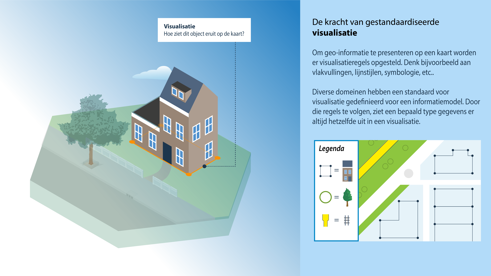

# Visualisatie

**Om geo-informatie te presenteren op een kaart worden er visualisatieregels opgesteld. Denk bijvoorbeeld aan vlakvullingen, lijnstijlen, symbologie, etc.. Diverse domeinen hebben een standaard voor visualisatie gedefinieerd voor een informatiemodel. Door die regels te volgen, ziet een bepaald type gegevens er altijd hetzelfde uit in een visualisatie.**

<figure id="pd2">

<figcaption>Visualisatie</figcaption>
</figure>

> TBD

## Overzicht geostandaarden visualisatie

Het standaardiseren van visualisatie (vlakvullingen, lijnstijlen, symbologie, etc.) wordt steeds belangrijker. Veel inhoudelijke domeinen overwegen het formeel vastleggen van een standaard visualisatie voor hun informatiemodel en zoeken een geschikte standaard om dit vast te leggen. OGC biedt hiervoor diverse specificaties: 

-   **Styled Layer Descriptor** (SLD) en **Symbology Encoding** (SE): Deze standaarden beschrijven samen de specificatie voor het beschrijven van visualisaties voor OGC services;

-   **Web Map Context Documents** (XML syntax) geeft de mogelijkheid om de status van een WMS client (viewer) vast te leggen. Denk aan een combinatie van een aantal WMS services, (subset) van een legenda, layers (styles, formats), inzoom schaal, etc.. Deze situatie kan op een client worden opgeslagen en worden uitgewisseld naar andere WMS clients zodat deze dezelfde Web Map Context hebben;

-   **Mapbox Styles** is een de-facto standaard uit de markt voor webvisualisatie van geo-informatie. Het versiebeheer van deze specificatie is niet beschreven en dit raamwerk verwijst daarom niet naar een specifieke versie maar naar de meest actuele; 

-   **OGC API Styles** is een nieuwe OGC standaard om stijlen en hun metadata (visualisatieregels) op te vragen, te bewerken en te valideren via een API. De stijlen zelf kunnen in SLD 1.0, SLD 1.1 of Mapbox Styles zijn uitgedrukt;

- **3D Tiles** is een goedgekeurde OGC community standaard voor het publiceren van 3D geo-informatie als tiles. Deze standaard bevat ook 3D Tiles Styles, een manier om declaratieve visualisatiespecificaties te beschrijven die je op tilesets kunt toepassen;

- **Indexed 3D Scene Layers** (i3S) is ook een goedgekeurde OGC community standaard. Het specificeert een formaat, opgebouwd uit gestandaardiseerde lagen, voor efficiënte 3D visualisatie op het web.

<aside class="note">3D visualisatie wordt steeds belangrijker. Hiervoor zijn verschillende
    desktop-applicaties beschikbaar die bijvoorbeeld CityGML, Google SketchUp en
    andere formaten veelal gecombineerd kunnen gebruiken voor visualisaties. OGC
    services hiervoor zijn nog niet als standaard(en) uitgekristalliseerd, hier
    wordt momenteel aan gewerkt. Intussen worden meestal de-facto standaarden
    toegepast. Interessante ontwikkelingen vanuit W3C zijn: XML3D en X3D die
    beiden als doel hebben 3D services op het web zonder plug-ins voor browsers
    (op basis van HTML5). Beiden komen vanuit W3C en het is nog onduidelijk
    welke richting het precies op gaat. KML en Collada zijn tevens prima
    geschikt voor 3D visualisatie.</aside>

 Europese profielen voor visualisatie zijn beschikbaar in de vorm van visualisatieregels voor dataproducten en informatiemodellen. Deze zijn beschreven in SLD en SE voor de Europese INSPIRE profielen; in de hoofdstukken 11 van de INSPIRE data specificaties is portrayal gedefinieerd volgens **Styled Layer Descriptor** en **Symbology Encoding**.

Ook in Nederlandse profielen worden visualisatieregels toegepast zoals in de [Visualisatieregels van de BGT](#bgtvoorbeeld).

In tabel 4.1 zijn de geo-standaarden voor visualisatie opgenomen. 

*Tabel 4.1 - Standaarden en specificaties voor visualisatie*

<table>
  <colgroup>
  <col style= "width: 34%;" >
  <col style= "width: 33%;" >
  <col style= "width: 33%;" >
   </colgroup>
  <thead>
    <tr>
      <th> Internationale standaarden en specificaties </th>
      <th> Europese profielen </th>
      <th> Nederlandse profielen </th>
    </tr>
  </thead>
  <tbody>
    <tr>
      <td>ISO 19117 Geographic Information – Portrayal [[iso19117]] </td>
      <td>Visualisatieregels voor INSPIRE data specificaties </td>
      <td>Visualisatieregels voor informatiemodellen </td>
     </tr>
    <tr>
      <td>OGC Styled Layer Descriptor Implementation Specification, version 1.1.0 [[SLD11]] </td>
      <td> </td>
      <td> </td>
     </tr>
    <tr>
      <td>OGC Symbology Encoding Implementation Specification, version 1.1.0 [[SE11]]  </td>
      <td> </td>
      <td> </td>
     </tr>
    <tr>
      <td>OGC Web Map Context Documents Implementation Specification, version 1.1 [[WMC11]] </td>
      <td> </td>
      <td> </td>
     </tr>
    <tr>
      <td>Corrigendum for Implementation Standard Web Map Context Documents – Corrigendum 1, version 1.1.0 [[WMCC11]] </td>
      <td> </td>
      <td> </td>
     </tr>
    <tr>
      <td>Mapbox Styles [[MBS]] </td>
      <td> </td>
      <td> </td>
     </tr>
    <tr>
      <td>OGC API Styles 1.0.0 **Draft** [[OAPISTYLES]] </td>
      <td> </td>
      <td> </td>
     </tr>
    <tr>
      <td>3D Tiles 1.1 [[3DTILES]] chapter 10, Declarative styling specification </td>
      <td> </td>
      <td> </td>
     </tr>
    <tr>
      <td>OGC Indexed 3D Scene Layers v1.3 [[I3S]] </td>
      <td> </td>
      <td> </td>
     </tr> 
  </tbody>
</table>

## Kwaliteit en visualisatie

### Visualisatieregels data producten en informatiemodellen

Een visualisatie is geen onderdeel van een informatiemodel of dataproduct, maar is een apart aspect. Alleen over de visualisatie van teksten wordt indien nodig iets gezegd in de informatiemodellen. De visualisatie van objecten en dataproducten wordt beschreven in visualisatieregels. Deze worden vastgelegd in een bijlage of in een handreiking. In elke visualisatieregel is vastgelegd van welke selectie van objecten dit de visualisatie is (zie voorbeeld 1 hieronder). 

<aside class="example" title="Visualisatieregels van de BGT" id="bgtvoorbeeld">

Voor de BGT|IMGeo zijn zeven presentaties beschikbaar. Deze zijn beschreven in de [Handreiking BGT\IMGeo Visualisatieregels 2.3
(2018)](https://docs.geostandaarden.nl/bgt/def-hr-visualisatie-20181015/):

-  <u>Standaardvisualisatie</u>: een visualisatie voor het gebruik van de
    BGT/IMGeo-inhoud als hoofdthema, die aansluit bij de visualisatie van de
    Basisregistratie Topografie (BRT). In de standaardvisualisatie worden alleen
    de puntsymbolen voor CADO, verkeersdrempel en kering toegepast. Omwille van
    de visuele hiërarchie wordt met klem geadviseerd om de icoonvisualisatie van
    IMGeo puntobjecten NIET af te beelden in combinatie met de
    standaardvisualisatie.
-   <u>Achtergrondvisualisatie</u>: een visualisatie voor het gebruik van de
    BGT/IMGeo-inhoud als achtergrondkaart, die aansluit bij de visualisatie van
    de BRT-Achtergrondkaart zoals die is gerealiseerd voor Publieke
    Dienstverlening op de Kaart (PDOK).
-   <u>Icoonvisualisatie</u>: een visualisatie van de puntsymbolen voor het gebruik van
    de IMGeo-inhoud, die aansluit bij de hiervoor genoemde
    achtergrondvisualisatie. Omwille van de visuele hiërarchie wordt met klem
    geadviseerd om de icoonvisualisatie NIET af te beelden in combinatie met de
    standaardvisualisatie.
-   <u>Lijngerichte visualisatie</u>: een visualisatie voor het gebruik van de
    BGT/IMGeo-inhoud als hoofdthema, die aansluit bij de visualisatie van de
    Grootschalige Basiskaart Nederland (GBKN). Alle individuele objecten met
    dezelfde eigenschappen die aan elkaar grenzen worden aaneengesloten
    gevisualiseerd. De begrenzingen tussen de individuele objecten vallen
    hierbij weg om zo een rustiger kaartbeeld te realiseren. Hiervoor wordt wel
    een witte vlakvulling meegegeven aan de objecten.
-   <u>Omtrekgerichte visualisatie</u>: een visualisatie voor het gebruik van de
    BGT/IMGeo-inhoud als hoofdthema, die aansluit bij de visualisatie van de
    Grootschalige Basiskaart Nederland (GBKN). Alle individuele objecten worden
    apart gevisualiseerd. De begrenzingen tussen de individuele objecten blijven
    gehandhaafd.
-   <u>Pastelvisualisatie</u>: een visualisatie voor het gebruik van de
    BGT/IMGeo-inhoud als achtergrondkaart, die aansluit bij de behoefte van
    civiel-technische ingenieursbureaus en de kabels- en leidingenketen om
    informatie over haar bouwwerken, kunstwerken en infrastructuur af te beelden
    op de BGT/IMGeo-inhoud.
-   <u>Planvisualisatie</u>: een visualisatie voor het gebruik van de
    planinformatie-inhoud.

</aside>

### Kaartvisualisatie voor webapplicaties

Voor ontwikkelaars van geografische webapplicaties, is in 2010 de handreiking webcartografie ontwikkeld. In de handreiking webcartografie [[HRWC]] vind je praktische tips over hoe je geo-informatie - waar mogelijk - binnen de bedoelingen van de toegankelijkheidseisen kunt aanbieden.

### Handreiking 3D Tiling

De handreiking 3D Tiling [[HR3DT]] heeft tot doel bij te dragen aan het breder gebruik van 3D data in Nederland met de adoptie van 3D Tiles in het bijzonder. Door best practises (praktische richtlijnen) te bieden voor de implementatie van 3D Tiles, kunnen verschillende systemen en softwareoplossingen (tools) beter met elkaar samenwerken, wat cruciaal is voor de uitwisseling van de visualisaties van 3D data in GIS applicaties en digital twins. Via de best practises biedt de handreiking mogelijkheden voor bredere acceptatie en verspreiding van 3D Tiles binnen de Nederlandse gebruiksgemeenschap en vele verschillende belanghebbende organisaties.

### Toegankelijkheid & geo-informatie

Sinds 1 juli 2018 geldt het [Tijdelijk besluit ‘Digitale toegankelijkheid overheid’](https://zoek.officielebekendmakingen.nl/stb-2018-141.html). Websites van de overheid moeten vanaf die datum verplicht voldoen aan de toegankelijkheidseisen voor mensen met een beperking. Dit besluit stelt echter in artikel 2 lid 2d expliciet dat het besluit niet van toepassing is op onlinekaarten. Het besluit volgt daarmee de [Europese richtlijn](https://eur-lex.europa.eu/legal-content/NL/TXT/HTML/?uri=CELEX:32016L2102&qid=1481290140258&from=en) inzake de toegankelijkheid van de websites en mobiele applicaties van overheidsinstanties. Enige uitzondering is dat in het geval van kaarten voor navigatietoepassingen de essentiële informatie ook op een andere manier (lees: routebeschrijving in tekst) toegankelijk gemaakt moet worden. In de handreikingen digitaal toegankelijke locatiedata [[HRTOEG]] en de handreiking webcartografie vind je praktische tips over hoe je geo-informatie - waar mogelijk - wel binnen de bedoelingen van de toegankelijkheidseisen kunt aanbieden.

<aside class="note">Dit document is de webversie van oorspronkelijk in januari 2015 gepubliceerde PDF document. Het is gebaseerd op Web Content Accessibility Guidelines (WCAG) 2.0 [[WCAG20]]. Er zijn al enige tijd vernieuwde toegankelijkheidseisen en wetgeving over digitale toegankelijkheid, gebaseerd op WCAG versie 2.1 [[WCAG21]]. Dit document is hier nog niet op aangepast.</aside>